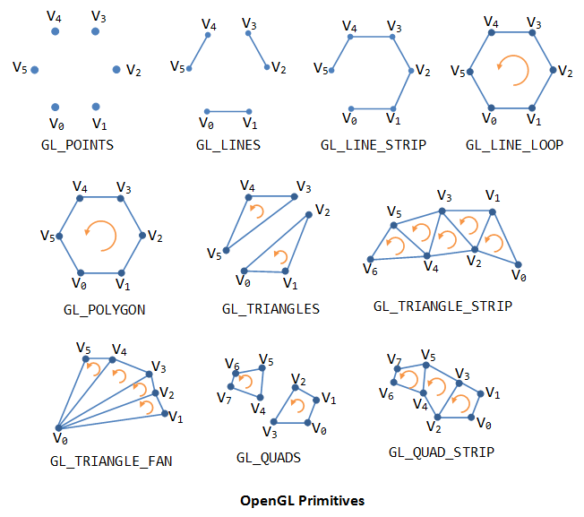

[](http://www.theexternalworld.com/)

# Programming and space

Just as with time, to work with space we need to understand how space can be represented, how spaces can be mapped and transformed, and what representations and transformations are used by existing programming libraries. But we also need to understand how space is perceived.

## Perception of space

### Picture plane and frame

The picture plane is the (normally rectangular) space of the projection screen, LCD screen, monitor, touchscreen etc.; the frame as a physical object. The frame is a window onto our work, part of its limiting edges – just like when we use our fingers to limit a view. 

- The relationship of objects (or points of attention) and frame can convey meaning. Photographers and painters know the 'rule of thirds': placing important objects at one- or two-thirds of the horizontal or vertical span. Cutting an object by the frame can be very jarring. 


- With movement, the frame can also convey the meaning of the view: a distanced, objective world-view, a passive observer, a point-of-view subjectivity, an abstract or dream-like perception...
- We can split the screen space into divisions. Cinema has used this for parallel timelines, software interfaces use this for modal inspectors, menu bars, etc. 
- We can break the boundary of the frame by imposing a new frame shape (such as a circular vignette) or boundary (blurred edges). 
- We can suppress consciousness of the bounding frame and emphasize "open space". Open space increases immersion and involvement of the viewer. 
	- By eliminating objects that emphasize the frame (horizontal and vertical lines, or using lighted subjects within a black world)
	- By creating movement that is stronger than the frame: random multi-directional movements, long tracks into or out of the frame, and hand-held camera style.
- With multi-projector systems or head-mounted displays, we can attempt to erase the frame entirely and create a fully immersive environment.


- With augmented reality and mixed devices, we can overlay (or underlay) real and virtual content dynamically. Nevertheless, we must still be sensitive to the effects of framing, particularly when it cuts stereoscopic depth.

### Depth

The Screen is a 2-D surface, with no real depth. Most moving images create an illusion of natural 3-D space upon this screen. [Depth cues](http://en.wikipedia.org/wiki/Depth_perception) that can increase or decrease the sense of depth:

- Size: Distant objects are smaller
- Perspective convergence – aided by using angled lines with vanishing points (one, two or three+), with many different suggestive energies. These lines may belong to land, buildings, objects, actors, or abstract forms.
- Stereopsis – applying correct perspective shift (parallax) for each eye. 
- Occlusion – overlapping objects suggest depth.
- Lighting and shading - accurate modeling of lighting effects can give a strong sense of three dimensionality and depth.
- Movement – lateral movement diminishes depth sensation, while depth movement or depth-relative movements can reinforce perspective. Rotation displays three-dimensional form, even when reduced to silhouette (the *kinetic depth effect*). 
- Camera movement – dollying shots tend to emphasize depth by motion parallax (no matter the direction), whereas pans and zooms tend to flatten the image.
- Camera movement
- Textural diffusion – distant objects are smaller and thus carry less textural detail. In computer graphics this is sometimes referred to as *level of detail*. 
- Shadows help to locate an otherwise ambiguous object by reference with other objects, particularly when shadows fall on a ground plane.
- Saturation and contrast tends to attenuate with distance, due to scattering effects of atmospheric particles; this is more pronounced in dense fog. 
- Brightness & color separation – bright objects are usually perceived as being nearer than dark objects, and warm colors (red, orange, yellow) are perceived as being nearer than cold colors (green, blue). Mountains are blue. Increasing tonal or brightness contrast over the various depths in the scene also assist depth cueing. 
- Focus – objects that are out of focus lose many depth cue features, and thus an out-of-focus shot usually creates a more planar perspective.

The absence of depth cues tends to produce a flat space, while ambiguous and contraditctory cues can create an ambiguous or disorienting perception of space. 

A film utilizes **deep space** when significant elements of an image are positioned both near to and distant from the camera. For deep space these objects do not have to be in focus. 	In narrative contexts, it can integrate the characters into their natural surroundings, map out the actual distances involved between one location and another.


 
In shallow space the image is staged with very little depth. The figures in the image occupy the same or closely positioned planes. While the resulting image loses realistic appeal, its flatness enhances its pictorial qualities. Shallow space can be staged, or it can also be achieved optically, with the use of a telephoto lens.This is particularly useful for creating claustrophic images, since it makes the characters look like they are being crushed against the background.


Animation begins in an ambiguous space, and much work is required to create convincing depth cues; photography however begins in real space, and effort is required to create (and maintain) an ambiguous space, since our perception always works to map the phenomenological space to a particular scale & position.

### Form

- Foreground and background
	- figure-ground relations, subject and environment, positive and negative space
- Proportion
	- rule of thirds, golden ratio, harmonic ratios
- Balance and symmetry
	- symmetry/balance suggests contemplation and stability, asymmetry/imbalance suggests emotion and change
	- parallel and perpendicular
- Enclosure creates sub-spaces and volume
- Texture suggests tactile sensation

Consider Kandinsky's [Point and Line to Plane](http://books.google.co.kr/books?id=dIvm5kmGZWkC&dq=point+and+line+to+plane) and Klee's [Pedagogical Sketchbook](http://ing.univaq.it/continenza/Corso%20di%20Disegno%20dell'Architettura%202/TESTI%20D'AUTORE/Paul-klee-Pedagogical-Sketchbook.pdf).


## Good old-fashioned OpenGL 1

Before leaping into GL 2.1, it's worth seeing how things used to be done, because although it is less flexible or efficient, in many ways it is easier to learn.

The first thing to learn is that OpenGL is highly **stateful**. For example, **gl.Color()** will set the current color, and any geometry drawn after it will use that color, until another **gl.Color()** changes it. You can think of it like the current brush in your hand. OpenGL also uses state to store spatial transformations, such as the view and object (gl.MODELVIEW) and the current perspective (gl.PROJECTION). 

### Geometry

Geometry in OpenGL is specified as a series of *vertices*, where each vertex has a position in space, and possibly other attributes such as color, texture coordinate, normal direction, and so on. Vertices simply define a set of points, but we can instruct OpenGL to interpret them as surfaces (or lines, or points) using the following constants:



In OpenGL 1 this is done using the **gl.Begin()** call, e.g. **gl.Begin(gl.LINES)**. After a **gl.Begin()** we can issue a number of vertices using **gl.Vertex()**, and finally finish our shape using **gl.End()**:

```
local gl = require "gl"

function draw()
	gl.Color(1, 1, 1)
	gl.Begin(gl.LINES)
		gl.Vertex(0, 0, 0)
		gl.Vertex(1, 1, 0)
	gl.End()
end
```

To change attributes of each vertex, we must call the attribute setters before the corresponding **gl.Vertex()**:

```
local gl = require "gl"

function draw()
	gl.Begin(gl.LINES)
		gl.Color(0, 0, 1)
		gl.Vertex(0, 0, 0)
		
		gl.Color(1, 0, 0)	
		gl.Vertex(1, 1, 0)
	gl.End()
end
```

Some common geometries have been abstracted in the **draw2D** module:

```
local draw2D = require "draw2D"

function draw()
	draw2D.color(1, 0, 0)
	draw2D.rect(0, 0, 1, 1)
	
	draw2D.color(1, 1, 0)
	draw2D.ellipse(0, 0, 1, 1)
end
```

### Transformation stacks

If we want to render the same geometry at different locations, scales and rotations in space, we would normally have to recalculate the positions of each argument to each **gl.Vertex()**. Instead, OpenGL provides transformation stacks. The default stack is the *MODELVIEW* stack, which represents the current location, scale and orientation of geometry in the world. You can *translate*, *rotate* and *scale* the modelview.  You could think of translation as meaning changing the 'start point' (in mathematical terms, the "origin") of drawing. Or you could think of it as moving the underlying "graph paper" that we are drawing onto. Similarly for the rotating the paper, or scaling it. 

```
local draw2D = require "draw2D"

function draw()
	draw2D.translate(-1, 0)
	draw2D.scale(0.5, 0.5)

	draw2D.color(1, 0, 0)
	draw2D.rect(0, 0, 1, 1)
	
	draw2D.color(1, 1, 0)
	draw2D.ellipse(0, 0, 1, 1)
end
```

Unlike gl.Color(), draw2D's *translate()*, *scale()* and *rotate()* do not replace the previous values; instead they accumulate on top of each other into a hidden state called the transformation matrix, which is a fancy name for how we get from the coordinate system in which we are currently drawing to the coordinate system of the actual output pixels. 

Note that the order of transformations is important: translate followed by scale is quite different to scale followed by translate. For controlling an object, usually the order used is "translate, rotate, scale". 

The transformation stack is called a *stack* because you can push and pop it:


*Pushing* the stack allows you to modify the transformation temporarily, and then later *pop* back to the previous state. Usually OpenGL provides up to 16 possible transformations on the stack.

```
local draw2D = require "draw2D"

function draw()
	draw2D.push()
		draw2D.translate(-1, 0)
		draw2D.scale(0.5, 0.5)

		draw2D.color(1, 0, 0)
		draw2D.rect(0, 0, 1, 1)
	draw2D.pop()
	
	draw2D.color(1, 1, 0)
	draw2D.ellipse(0, 0, 1, 1)
end
```

The **draw2D** module provides push, pop, translate, rotate and scale for 2D rendering. For more complex rendering, use **gl.LoadMatrix()** (to replace the previous value) or **gl.MultMatrix()** (to accumulate with the previous value) in combination with one of the matrix transform generators in the **mat4** module:

```
-- this does the same thing as the previous script:

local gl = require "gl"
local draw2D = require "draw2D"
local mat4 = require "mat4"

function draw()
	gl.PushMatrix()
		gl.LoadMatrix(mat4.translate(-1, 0, 0))
		gl.MultMatrix(mat4.scale(0.5, 0.5, 1))
		
		draw2D.color(1, 0, 0)
		draw2D.rect(0, 0, 1, 1)
	gl.PopMatrix()
	
	draw2D.color(1, 1, 0)
	draw2D.ellipse(0, 0, 1, 1)
end
```

With this we can easily now create ideal visual forms, and then create instances of these forms with different position, scale and rotation, however we please. We're about ready for some generative design...

> Warning: if you want to do something computational according to the position, it's better not to use the OpenGL transformation stack, as it does not give you access to the computed position. Instead you'll have to compute it manually... 


## Shader program

At any time the GPU may have one shader program bound. Typically the shader program will contain a vertex shader and a fragment shader. These allow us to insert our own code into the rendering pipeline at the vertex transformation and fragment coloring stages.

## Vertex shader

Each vertex in the vertex array is sent through the vertex program. The vertex program determines how to modify each vertex. At minimum, it must compute the actual position of the vertex in screen space (by setting the **gl_Position** variable). 

Here is a simple vertex shader:

```
// the input position of the vertex:
attribute vec3 position;

void main() {
	gl_Position = vec4(position.x, position.y, 0., 1.);
}
```

Vertex shaders may make use of **attributes**, values that are set for each input vertex. Typical vertex attributes are position, color, normal (surface direction), texture coordinate (for applying texture mapping).

Note that the GLSL language provides support for vector types (vec2, vec3, vec4) and matrix types (mat2, mat3, mat4) in the language itself, since these are so fundamental to graphics programming. 

## Fragment shader

For each pixel of a rendered triangle, the fragment shader is run to compute the pixel color (by setting the **gl_FragColor** variable). Here is a simple fragment shader:

```
uniform vec3 lightcolor;

void main() {
	// paint all pixels opaque red:
	vec3 red = vec3(1, 0, 0);
	// compute pixel color by multiplying with the light color:
	vec3 color = lightcolor * red;
	// store that as the result, with an alpha (opacity) value of 1:
	gl_FragColor = vec4(color, 1);
}
```

A **uniform** is a way to pass data from the CPU to either vertex or fragment shader. Uniform data has the same value for all vertices/fragments, but can change in successive renders. References to textures are also passed as uniforms (of type **sampler2D**).

Loading, compiling, linking and using shaders requires some fiddly OpenGL code, which we have abstracted into the **shader** module (take a look inside it to see how it works):

```
-- load in the shader utility module:
local shader = require "shader"

-- write the GLSL code:
local vertex_code = [[
	// the input position of the vertex:
	attribute vec3 position;

	void main() {
		gl_Position = vec4(position.x, position.y, 0., 1.);
	}
]]
local fragment_code = [[
	uniform vec3 lightcolor;

	void main() {
		// paint all pixels opaque red:
		vec3 red = vec3(1, 0, 0);
		// compute pixel color by multiplying with the light color:
		vec3 color = lightcolor * red;
		// store that as the result, with an alpha (opacity) value of 1:
		gl_FragColor = vec4(color, 1);
	}
]]

-- use this GLSL code to create a new shader program:
local myshaderprogram = shader(vertex_code, fragment_code)

-- the rendering callback:
function draw()
	-- start using the shader:
	myshaderprogram:bind()
	-- set a shader uniform:
	myshaderprogram:uniform("lightcolor", 0.5, 0.5, 0.5)
	
	-- RENDER VERTICES HERE
	
	-- done using the shader:
	myshaderprogram:unbind()
end
```

## Vertex buffers

To make use of the shader we must send some vertices. Each vertex may have a number of attributes, including location, normal, color, texture coordainates, etc. All these together make the vertex buffer.

> We can also supply an additional *element array*, which is an array of indices into the vertex buffer specifying the order to render them. This allows us to use one vertex more than once, or even skip a vertex we don't want to use. It determines how the vertices become triangles.

Creating and using vertex buffers requires some fiddly OpenGL code, because it can be very generic. We have abstracted the most common case into the **vbo** module (take a look inside it to see how it works):

```
-- load in the utility module for vertex buffer objects
local vbo = require "vbo"

-- create a VBO object to store vertex position and color data
-- this vbo contains 3 vertices (1 triangle):
local vertices = vbo(15)

-- set the vertex positions:
vertices[0].position:set(-1, -1, 0)
vertices[0].position:set( 1, -1, 0)
vertices[0].position:set( 0,  1, 0)


function draw()
	-- start using the shader:
	myshaderprogram:bind()
	-- set a shader uniform:
	myshaderprogram:uniform("lightcolor", 0.5, 0.5, 0.5)
	
	-- tell the shader_program where to find the 
	-- 'position' attributes
	-- when looking in the vertices VBO:
	vertices:enable_position_attribute(myshaderprogram)
	
	-- render using the data in the VBO:
	vertices:draw()
	
	-- detach the shader_program attributes:
	vertices:disable_position_attribute(myshaderprogram)
	
	-- detach the shader:
	myshaderprogram:unbind()
end
```

-----

[](https://fbcdn-sphotos-d-a.akamaihd.net/hphotos-ak-ash3/1146629_10152155549169896_1044586992_n.jpg)

-----

[OpenGL 2.1 Reference Pages](http://www.opengl.org/sdk/docs/man2/)
[An intro to modern OpenGL](http://duriansoftware.com/joe/An-intro-to-modern-OpenGL.-Table-of-Contents.html)
[Lighthouse GLSL 1.2 Tutorial](http://www.lighthouse3d.com/tutorials/glsl-tutorial/)


# Programming

> [wikipedia:](http://en.wikipedia.org/wiki/Programming_language) A programming language is a formal language designed to communicate instructions to a machine, particularly a computer. Programming languages can be used to create programs that control the behavior of a machine and/or to express algorithms precisely. The earliest programming languages preceded the invention of the computer, and were used to direct the behavior of machines such as Jacquard looms and [player pianos](http://en.wikipedia.org/wiki/Player_piano). Thousands of different programming languages have been created, mainly in the computer field, and still many are being created every year. Most programming languages describe computation in an imperative style, i.e., as a sequence of commands, although some languages, such as those that support functional programming or logic programming, use alternative forms of description.

When using a natural language to communicate with other people, human authors and speakers can be ambiguous and make small errors, and still expect their intent to be understood. However, figuratively speaking, computers "do exactly what they are told to do", and cannot "understand" what code the programmer intended to write. The combination of the language definition, a program, and the program's inputs must fully specify the external behavior that occurs when the program is executed. To make this easier, programming languages and implementations may provide many tools of specification and abstraction, and many libraries of re-usable routines and capabilities.

## Semiotics

Programming languages and implementations can be understood in terms of semiotics: the syntax, semantics and pragmatics.

### Syntax

**The relations among signs in formal structures.** Syntax specifies all possible (valid) combinations of the surface form. Usually textual, but can also be graphical. May be described using a grammar. 

A syntax checker verifies the input text matches the syntax rules, or may indicate an error otherwise. A syntactically correct piece of code is not necessarily semantically correct, just as a syntactically correct English sentence does not necessarily have a logical meaning ([E.g. Chomsky's "Colourless Green Ideas Sleep Furiously"](http://en.wikipedia.org/wiki/Colorless_green_ideas_sleep_furiously))

> The study of grammar, the rules of correct structure of language, can be traced back two and half thousand years in ancient India, where the belief had been held that the correct structure and intonation of words had power.

### Semantics

**The relation between signs and meaning (the things to which they refer).** Semantics maps from program language syntax to program behavior. Some semantic constraints can be analyzed from the source code, others may only be detectable once the program runs. Industry languages tend to include more features aimed to detect semantic errors at compile-time, such as strict type systems.

### Pragmatics

**The relation between signs and sign-using agents (e.g. programmers!).** In linguistics, pragmatics describes the relation between signs and the agent using them, and the way context relates to meaning. In computing, this may encompass the hardware (or virtual machine implementation) that a program runs on, the available libraries and resources, as well as real-world interactions and performance. 

The standard library and run-time system provided by a language implementation can be more important than the language itself.

## Programming languages

There are thousands of programming languages in use today. From a purely abstract, mathematical point of view, most of them have equivalent computing power (delimited by the [universal Turing machine](http://en.wikipedia.org/wiki/Turing-computable_function#Models_equivalent_to_the_Turing_machine_model)). Practically however the choice of language/implementation to use may depend on factors of performance, familiarity, the quality of documentation and supporting libraries, ease of distribution, and so on. 

### Try out different languages in the browser

- [Codepad.org](http://codepad.org/)
- [Repl.it](http://www.repl.it/languages)

### Hello, world

Since the K&R book ["The C Programming Language"](http://cm.bell-labs.com/cm/cs/cbook/), many language tutorials begin with the ["hello, world"](http://en.wikipedia.org/wiki/Hello_world_program) program: a program that simply prints "hello, world" and exits.

```cpp
// hello, world in C:
int main() {
	printf("hello, world\n");
	return 0;
}
```

```java
// hello, world in Java:
public class HelloWorld {
	public static void main(String [] args) {
		System.out.println("hello, world");
	}
}
```

```php
// hello, world in PHP:
&lt;?php echo("hello, world"); ?&gt;
```

```javascript
// hello, world in JavaScript:
console.log("hello, world");
```

```python
# hello, world in Python:
print("hello, world")
```

```lua
-- hello, world in lua:
print("hello, world")
```

See [more examples at codepad.org](http://codepad.org/hello-world)

## Compiled language example: C

The **C** programming language is one of the oldest still in wide use today, originally developed between 1969 and 1973 at AT&T Bell Labs. It became the 'de facto' language for system development in UNIX, and continues to be a primary language for software, operating systems, hardware devices, etc. today. It aims to provide a higher-level language that nevertheless does not obscure details of the underlying system. It is extremely well-defined and thus also serves as a consistent application binary interface (ABI) for operating between different programs and languages. For example, [LuaJIT can easily inter-operate with C via a foreign-function interface (FFI)](http://luajit.org/ext_ffi.html). 

Programs written in C stored in text files (with ".c" extension) and converted to binary applications (and libraries) using a **compiler** such as ```gcc``` or ```clang```; or simply invoked by the alias ```cc```. The following terminal command tells the compiler to compile the file ```hello.c``` and save the binary executable output (via the ```-o``` flag) to be called ```hello```:

	cc hello.c -o hello
	
Now we can run this file like so:

	./hello
	
On Windows [it looks slightly different](http://msdn.microsoft.com/en-us/library/ms235639.aspx):

	cl hello.c
	hello
	
### Linking with a library	

What if the standard C run-time library doesn't offer capabilities we need? Then we can search for a library that already exists and link to that (so long as the license fits our needs). For example, C doesn't know how to read and write sound files, but the [libsndfile](https://github.com/erikd/libsndfile) library is designed to do just that. So the first thing we need to do is download & install it. 

	...
	
Once installed, we need to tell the compiler where to find it. There are two parts to a library: the **binaries** which contain the actual machine code, and the **headers**, which are text files definining functions and types that tell you (and the compiler) how you can use the binaries. For example, library binaries might be installed into */usr/lib* or */usr/local/lib* on OSX/Linux, and headers into */usr/include* or */usr/local/include*. We can tell the compiler where to look using the **-I** and **-L** flags (**/I** and **/link /LIBPATH** on Windows):

	cc -I/usr/local/include hello.c -L/usr/local/lib -o hello
	
But that only tells the compiler where to look. To actually use the headers we need to **#include** them in the source:

	&#35;include &lt;sndfile.h&gt;


And we also must tell the compiler to link the binary in our command, using the **-l** flag (or just the library name on Windows):

	cc -I/usr/local/include hello.c -L/usr/local/lib -lsndfile -o hello

Sometimes the header file of a library is enough to understand how to use it, but usually we also want to refer to human-friendly [documentation and tutorial material](http://www.mega-nerd.com/libsndfile/api.html). 

This is only a *very very very basic* introduction to compiling C from the command line; reality can be *far far far more complicated*. Too complicated, really.

## Dynamic language example: Lua

See [lua tutorial](lua.html)

## Data structures

A data structure is a way to meaningfully organize data. Principally the task is to design a layout schema for memory that provides optimal performance for the desired task(s) the data structure will be used for. 
	
### Contiguous memory

E.g. 1D Arrays and regular structs in C. 
	
- If all data is local (no references or pointers to other locations), then the memory describes plain-old-data (**POD**), which can be very easily copied, stored, retrieved etc. Sometimes there may be some 'unused' space in arrays or structs, e.g. to align struct fields or array rows on certain byte-length boundaries. 
- Multi-dimensional dense arrays. We can represent a 10x10-element **2D array** using a 100-element 1D array, simply by addressing the memory accordingly. If we consider the 2D array in terms of rows and columns, we must choose between row-major or column-major ordering, i.e. whether horizontal or vertical neighbors are contiguous. This determines how iteration loops are nested (i.e. is the inner loop over X or Y?). The same principle can be applied to 3D or higher-dimensional arrays. 
- Nested structures. A struct describes the semantics of a block of memory: what **type** of data is to be found at a particular **offset** within the memory block. It is composable: we can create arrays of structs, and structs that embed arrays and other structs. So long as all nested structures are POD, the whole is POD. 
- Access. Accessing a desired point in an array or struct is extremely fast and cheap, especially if the region accessed is nearby other regions that were recently accessed. This applies equally to nested structures. 

### Non-contiguous memory.

Any data structure that uses pointers or references. 

One problem with POD data is that it cannot grow or shrink in size: the size is determined when it is allocated, because memory cannot move. For example, a list of active notes may need to dynamically vary according to performer behavior, or a list of active agents in a game varies according to player behavior. 

> One POD-friendly solution is to pre-allocate enough space for a maximum number of items, and do not allow this to be exceeded. Another is to allocate a new, larger array when needed, and copy data from the old to the new, updating any references that were using it. Reallocation can be expensive and should not be used frequently.

The non-contiguous solution is to create a linked data structure, such as a linked list. A **linked list** contains a variable number of nodes, each of which contains or refers to the desired objects of the list, as well as *link* references to neighbor nodes. For example, a singly-linked list:


(images courtesy of [wikipedia](http://en.wikipedia.org/wiki/Linked_list))

Each node could be in a totally different area of memory, but we can easily "walk the list" by following the links. The advantage of this approach is that we can easily insert or remove an item from the middle of the list, simply by changing the link references:


A **doubly linked list** nodes have references in both directions, allowing traversal in either direction as well as simplifying removal:


A **circular linked list** maps the tail to the head, allowing infinite traversal:


By adding another link we can define structures with hierarchy, such as trees.


Using both arrays and linked lists we can create a number of useful data structures. Which one to use depends on the frequent and possible use cases in context. All the possible use cases must be supported, and the frequent use cases should perform optimally. Generally, if we require fast "random" access, an array is ideal, however if we require fast insertion and removal, a linked list is far better. 

### Stack

With a [stack](http://en.wikipedia.org/wiki/Stack_(data_structure)) we only ever manipulate one end of the list, adding or removing items. This is also called **LIFO** (last-in, first-out). If implemented using an array, all we need is an integer to indicate where the current top of the stack is. If using a linked list, all we need is a singly-linked list and a pointer to the current top. Stacks are very important to computing, and widely used in low-level language implementations. They are also used at higher levels, such as the Undo/Redo stack in any application.


### Queue

A [queue](http://en.wikipedia.org/wiki/Queue_(data_structure)) is also known as a FIFO (first-in, first-out), and implements pipe and stream behavior. We always add data at one end, and remove data at the other end.  It can be implemented on a fixed-size array using two 'head' and 'tail' indices, though this limits the maximum number of elements in the queue. It can be implemented on a linked list by keeping a reference to the head and tail nodes. 


A **deque** (pronounced "deck", like a deck of cards) is a "double-ended queue", in which items can be added and removed at both ends. It can be implemented on a doubly-linked list.

The elements of a **priority queue** also have an associated "priority", with which they are ordered (sorted). High priority events are served before low ones. For example, the start time of an event can be used to sort a list of events, such that earlier events are served first. Generally the two main tasks are to a) insert element with priority, and b) retrieve/remove the highest priority element. Often the list is preserved in a sorted state by being careful to only insert at the right location (a random-access insert). This is called "insertion sort". By doing so, retrieval/removal always occurs at one end. 

### Dictionary (aka Associative array or Map)

A [dictionary](http://en.wikipedia.org/wiki/Associative_array) stores pairs, mapping from keys to values. Keys are unique (no key appears twice). The dictionary can be indexed at random by a key to return the value, and new pairs can be added, old pairs can be removed or old keys assigned new values. The Lua table is essentially a dictonary. Implementation challenges center on how to quickly resolve a given key, often via a *hash*.

### Other structures

Sets, multisets, multimaps, trees, graphs, strings, ... 

## Live Programming, Live Coding

[Zen and the art of Live Programming](http://www.infoq.com/presentations/Live-Programming)
[TOPLAP](http://toplap.org/)
[Strange Places (Andrew Sorensen)](http://www.youtube.com/watch?v=TxQJPNSzl9s)

## Further reading

[Notes on Programming (Alexander Stepanov)](http://www.stepanovpapers.com/notes.pdf)

1. code should be partitioned into functions; 
2. every function should be most 20 lines of code; 
3. functions should not depend on the global state but only on the arguments; 
4. every function is either general or application specific, where general function is 
useful to other applications; 
5. every function that could be made general – should be made general; 
6. the interface to every function should be documented; 
7. the global state should be documented by describing both semantics of individual 
variables and the global invariants. 


-----

## Setting up a C development environment

** THIS SECTION IS INCOMPLETE **

Your operating system might not come with a compiler built-in, and it probably doesn't have all the libraries you need. Here's some quick notes on getting set up:

### Linux

Getting a compiler:

	sudo apt-get install gcc
	
For any other libraries, you can often get them with

	sudo apt-get install &lt;libraryname&gt;

In this case, *sudo* means execute with administrative privileges, *apt-get* is a program for installing software and libraries (a "package manager"), *install* is the action for apt-get, and *gcc* is the application we will install (it will also install all dependencies).

### OSX

Getting a compiler: For recent versions of OSX you must install command line tools manually. [You can do this from inside Xcode, or as a direct download from Apple](http://stackoverflow.com/questions/9329243/xcode-4-4-command-line-tools). Either way you will need to register with the Apple developer center. 

For any other libraries: There is no built-in "package manager" for OSX, but there are several that people have written. I currently recommend using one called "brew", which you can install by [following the instructions here](http://brew.sh). Once installed, run *brew doctor* to ensure your system is properly configured; do whatever it says until it is happy. Then, to install librares:

	brew install &lt;libraryname&gt;

### Windows

Install a recent Visual Studio (e.g. Visual Studio 2012); this includes a compiler and a command line, found in the Start menu under "Visual Studio command prompt".

Package managers for Windows are less usual; many libraries provide binaries or installers directly instead.

[](http://0800-putaria.tumblr.com/)


# Audio Programming

### Bit depth

The quantization bit depth of the representation determines the signal to noise ratio (SNR), or dynamic range. Every bit of resolution gives about 6dB of dynamic range, so a 24 bit audio representation has 144dB. 

The [decibel](http://en.wikipedia.org/wiki/Decibel) (dB) is a logarithmic unit to represent a ratio between to quantities of intensity. "The number of decibels is ten times the logarithm to base 10 of the ratio of the two power quantities." (IEEE Standard 100 Dictionary of IEEE Standards Terms). A change by a factor of 10 is a 10dB change, and a change by a factor of 2 is about a 3dB change.

Decibels are frequently used in two ways in audio: 

1. To represent the acoustic power of a signal, relative to a standard measure approximating the minimum theshold of perception. The loudness of different sound-making devices can be measured in decibels, which will typically be positive (louder than the reference threshold).
2. To represent the signal-to-noise ratio of a digital representation. In this case signals are measured in reference to the *maximum* power signal (amplitude value of +/- 1), and thus are typically negative. OdB indicates full power. Positive dB indicates signals above the representation range, which will be clipped, and negative dB indicates quieter signals. The range between full power and the smallest representable (nonzero) signal specificies the signal-to-noise ratio of a representation. 

The human ear can discriminate around 120dB of dynamic range, though this is frequency dependent. A 16 bit depth (standard CDs) provides around 120dB. However when operating and transforming audio greater headroom is needed.


## Excitation-resonance and other physical models

It is widely and often commented that purely electronic sounds are too thin, shallow, artificial, cold, pure, etc. We should know that this criticism does not apply to computer-generated sound *in principle*, as we can reconstruct rich, deep, impure sounds during sample playback. The criticism really applies to the mathematical models that have been often been used to solve the computer music problem. 

One response to this has been to attempt to recreate nature in the computer, by running simulations of the physical (usually kinetic, mechanical) systems of musical instruments. In the computer music community it is often referred to as **physical modeling**. A "model" predicts the behavior of a physical system from an initial state and input forces. A "physical model" is one using systems drawn from physics, such as mass-spring-damper systems. 

[Julius Smith's online book of physical modeling](https://ccrma.stanford.edu/~jos/pasp/)

Most acoustic physical models describe a process in which a source of energy (the "excitation") is transduced into the physical system, and then propagates as waves constrained by the system as a medium ("resonance"), some of which energy is transferred to pressure waves in the air ("sound") reaching our ears ("reception"). In fact most sounds that we hear in nature follow this form of excitation -> resonance. Several pheonomena are common:

- After the excitation is removed, energy gradually dissipates away
- The resonant objects (including the physical environment) emphasize certain frequencies over others (this is the "resonating" aspect), 
- High frequencies typically dissipate sooner than lower frequencies

These are such fundamental aspects of natural sound that our psychoacoustic experience is hard-wired to them. Sustained sounds suggest a continuous input of energy. Crescendoes in nature are rare (wind, waves, approaching elephants). 

### Vibrating strings

Perhaps the simplest physical model is the vibrating string, such as found on a guitar or gayagum. The excitation is by plectrum or finger rubbing against and displacing the string (a short burst of randomized energy), or a bow continuously imparting random displacements (a longer, sustained input of noise). The resonance of the string is the vibrations it supports, which gradually decay as the energy dissipates into the instrument body. The body itself also resonates in a rich way, transducing energy to airborne sound.

Because the string is constrained at each end, the only waveforms of vibration that can remain stable are proportional to integer divisions of the string length. This strongly constrains the sound produced, turning the rich spectrum of the noisy pluck into a more organized, decaying mixture of tones:


[Slow motion video of a bass string vibration](http://www.youtube.com/watch?v=XkSglALOueM)

The simplest model of a vibrating string was presented by Karplus and Strong:


1. A noise burst (representing the pluck) is used as input added to a delay line. 
2. The delay line length defines the fundamental tone of the string. 
3. The feedback path includes a filter to emulate the way energy is gradually dissipated from the string (usually removing higher frequencies more quickly than lower ones). The gain of the filter must be less than 1 to avoid saturated feedback.

---

## Granular synthesis and microsounds

Granular synthesis is a basic sound synthesis method that operates by creating sonic events (often called "grains") at the microsound time scale.

> Microsound includes all sounds on the time scale shorter than musical notes, the sound object time scale, and longer than the sample time scale. Typically this is shorter than one tenth of a second and longer than ten milliseconds, including the audio frequency range (20 Hz to 20 kHz) and the infrasonic frequency range (below 20 Hz, rhythm). 

- [Microsound (Curtis Roads)](http://books.google.co.kr/books/about/Microsound.html) is the principal textbook

Microsound was pioneered by physicist Denis Gabor and explored by composers Iannis Xenakis, [Curtis Roads](http://www.youtube.com/watch?v=0mQ8zRZOlrk), [Horacio Vaggione](http://www.youtube.com/watch?v=K-FjnKiDWQc), [Barry Truax](http://www.youtube.com/watch?v=X7FoPo-kyoM), [Trevor Wishart](http://www.youtube.com/watch?v=lekLl7o8yrc), and many more.

Besides this, what is it useful for?

- Impulse trains
- Physical modeling of shaker-like instruments
- Speech synthesis (e.g. FOF)
- Wavelet analysis/resynthesis
- Time/frequency resampling effects such as pitch-shifting and time-stretching
- Separated processing of transients and stable waveforms, e.g. 
- Cricket chirps, frog croaks, etc.
- Many other sonic textures of variable density, color, quality, and stochastic distributions

Implementing a granular synthesis techinque involves two challenges:

1. **Specify the grain**: How to synthesize the individual samples of a grain (the *content*), how to specify the *duration*, what overall amplitude shape (the *envelope*) to apply, and how these can be parametrically controlled. 
2. **Specify how grains are parameterized and laid out in time**: Whether to arrange grains at equal or unequal spacing, how densely they overlap, and so on; how to distribute parameter variations through the grains of a particular granular "cloud". Often clouds include stochastic distributions.

### Grain content

Any sound source can be turned into a grain, by limiting the duration and choosing the envelope shape. It could be a mathematical synthesis technique, from a pure sine wave or noise source to a complex timbre. Or it could be a routine to select portions out of an existing waveform or input stream ("granulation"). 

With large populations of grains it can be very expensive to run complex routines for each grain. However as grain durations get shorter, there is less audible information stored in a grain and the exact synthesis algorithm becomes less important. Thus wavetable playback is often utilized.

### Grain envelope

Similarly, envelopes can be either computed dynamically, or read from precalculated wavetable data. The shape of an envelope becomes increasingly important in determining the perceived sound as durations get shorter. Most envelopes begin and end at zero amplitude. Denis Gabor originally suggesed a Gaussian envelope shape, but today applications can make use of many mathematical and procedural envelope shapes. 

Often the envelope chosen is symmetric in time, rising from zero to peak at half-duration and falling back to zero; these shapes are frequently also used as **window** functions for signal analysis. The spectral properties of windows, represented by their Fourier transforms, are very significant in determining how well they suppress aliasing noise in the analysis (aliasing noise results from a time/space trade-off due to finite discretization). If we define "norm" as a ramp from 0 to 1 over the duration, and "snorm" as a ramp from -1 to 1 over the duration, we can define many classic window shapes:

- Parabolic: 1 - snorm^2
- Cosine/Welch: sin(pi*norm), 
- Bartlett/Triangle: 2*min(norm, (1-norm))
- Gaussian: exp(-0.5 * (n*snorm)^2)
- Blackmann: 0.42-0.5*(cos(2*pi*norm)) + 0.08*cos(4*pi*norm)
- Hamming: 0.53836 - 0.46164*cos(2*pi*norm)
- Hann: 0.5*(1-cos(pi*2*norm))
- Sinc/Lanczos: sin(pi*snorm)/(pi*snorm)
- Nutall: 0.355768 - 0.487396*cos(2*pi*norm) + 0.144323*cos(4*pi*norm) - 0.012604*cos(6*pi*norm)
- Blackman-Harris: 0.35875-0.48829*cos(2*pi*norm)+0.14128*cos(4*pi*norm)-0.01168*cos(6*pi*norm)
- Blackman-Nutall: 0.3635819-0.4891775*cos(2*pi*norm)+0.1365995*cos(4*pi*norm)-0.0106411*cos(6*pi*norm)
- FlatTop / Kaiser-Bessel: 0.22*(1-1.93*cos(2*pi*norm)+1.29*cos(4*pi*norm)-0.388*cos(6*pi*norm)+0.032*cos(8*pi*norm))
- Bessel: 0.402-0.498*cos(2*pi*norm)+0.098*cos(4*pi*norm)-0.001*cos(6*pi*norm)

These an many other more complex window shapes are detailed [on the wikipedia page](http://en.wikipedia.org/wiki/Window_function), including time and frequency domain representations.

Other envelope shapes are non-symmetric, and will impart stronger percussive or reverse effects to the sounds:

- Inc: norm, Dec: 1-norm, Saw: snorm
- Expodec: (1-norm)^n, Rexpodec: norm^n (and logarithmic versions for n<0)
- Attack-release, attack-sustain-release, attack-decay-sustain-release and more complex linear, bezier or spline-segment shapes (some inspired by [note-envelopes common to synthesizers](http://en.wikipedia.org/wiki/Synthesizer#ADSR_envelope))
- Any symmetric window can be stretched by applying a non-symmetric transform to norm or snorm in advance.


In some cases an envelope is not needed at all, when the content can be arranged to have a natural intrinsic envelope shape.

### Grain distribution

The principal method of combining grains into a cloud is called "overlap-add". A *scheduler* maintains a list of grains to play, working through the list of grains (sorted by grain onset time) and playing each grain in turn. Each grain adds its samples to the output buffer, accumulating onto (rather than replacing) the samples of any other previously played grains with which it overlaps. This is essentially the same as mixing multiple musical notes together, only with much shorter durations (and more accurately placed onset times).

> In our software we already have sample-accurate overlap-add capability via audio.play() and audio.go()/audio.wait(). 

The great computer music problem appears again here: for populations of hundreds or thousands of grains, how to specify each grain's onset, duration, amplitude, spatial location and other parameters to create a meaningful result? Fortunately the situation for grains is more accessible than for individual samples.

The spacing of grain onset times can be regular (*synchronous*) or irregular (*asynchronous*). Regular placement of grains can introduce another audible frequency effect. Holding the grain rate constant but varying the duration can achieve formant effects and simulate vocal sounds. With randomly distributed onset times however, density becomes a principal parameter. At longer time scales it can create [rhythmic](http://www.youtube.com/watch?v=uIeA2ct5Sew) or ["bouncing"]( http://www.youtube.com/watch?v=MA6ZXYIfLpA) effects.

For granulation techniques, varying the start-point of the source waveform for each grain can be used to create time-stretching effects, or shifting the playback rate can be used to create pitch-shifting effects. Adding some random distribution to onset and duration can create a more organic, less metallic effect, but may weaken the strength of transients in the original. 

More generally, all parameters of a stream or cloud can be held constant, gradually shifted, randomly selected from a set, or distributed randomly around a center value as desired, to create many different complex shapes. Beyond this level, the task is to arrange the grains, streams and clouds together over space in time to construct a meaningful musical space. Changing the shapes of distributions over time was an important composition method of Iannis Xenakis. Beyond regular and random distributions, we could also explore the use of more generative algorithms such as Markov-chains, swarm dynamics and evolutionary algorithms.


----

## Sounds as summations of cyclic rotations (Fourier)

[A great interactive, visual explanation](http://toxicdump.org/stuff/FourierToy.swf)

----

## Non-histories of computer music

Delia Derbyshire (of Doctor Who fame):

- [Delia Derbyshire circa 1963!](http://youtu.be/szE5D-dPs_Y)
- [Delia Derbyshire etc. circa 1969!](http://youtu.be/K6pTdzt7BiI)

----

## General Resources

Online (free) texts:

- [Julius Smith's online DSP books](https://ccrma.stanford.edu/~jos/)
- [Miller Puckette's book](http://crca.ucsd.edu/~msp/techniques.htm)
- [Steven Smith's DSP book](http://www.dspguide.com/pdfbook.htm)

Non-free texts:

- [Audio Programming Book](https://mitpress.mit.edu/books/audio-programming-book)
- [Computer Music Tutorial](http://books.google.co.kr/books/about/The_Computer_Music_Tutorial.html?id=nZ-TetwzVcIC&redir_esc=y)
- [Musimathics](http://www.musimathics.com/)
- [Understanding DSP](http://www.amazon.com/Understanding-Digital-Processing-Edition-ebook/dp/B004DI7JIQ/ref=sr_1_1)
- [Understanding Fourier (if you don't know math)](http://www.amazon.com/Who-Is-Fourier-Mathematical-Adventure/dp/0964350408/ref=sr_1_2?ie=UTF8&qid=1384225180&sr=8-2&keywords=who+is+fourier%3F)

Forums

- [KVR (a lot of DSP and plugin development stuff, since years ago!)](http://www.kvraudio.com/forum/)
- [Create Digital Noise](http://createdigitalnoise.com/)
