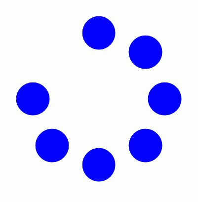
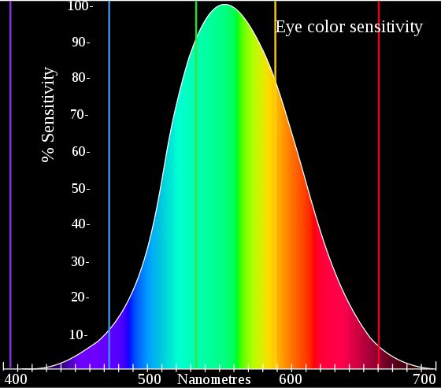

# Models of Computation

We have encountered three complementary models of abstract machines that are all theoretically equivalent, if quite different in what they reveal: procedural (Turing), string rewriting (Post), and functional (Church). Another pair of models we can draw upon is Data-flow and Control-flow:

Control-flow focuses on how machines move step by step or jump by jump between different kinds of operations, and thus has a more natural affinity with procedural programming -- more typically textual, though control-flow diagrams are also sometimes used.

Data-flow focuses on how data moves through a program. It is often associated with visual programming environments such as Max, but dates back much earlier to programs for circuit layout. Today it is also widely used in simulation sciences or for stream-processing applications. It often has affinity with more functional programming models as well as reactive/interactive designs. Note that spreadsheets are also forms of reactive data-flow programming. Data-flow has been argued as better handling work with concurrency.

as we may think / vannevar bush / Memex

[man machine symbiosis / licklider](https://en.wikipedia.org/wiki/Man-Computer_Symbiosis)

---youtube:yJDv-zdhzMY

notes:

"Mother of all Demos", Ivan Sutherland, 1968.

Relational databases, word processing, mouse & keyboard, hyperlinks, intranet, collaborative editing, webcams, ...

What would be an equivalent vision today?

# Ultimate Display

# Oulipo

# Cybernetics

---image:img/ferranti-mark1-controls.gif

notes:

The Manchester Baby was the world's first electronic stored-program computer, and ran its first program on 21 June 1948. It was a precursor to the Ferranti Mark 1, the world's first commercially available general-purpose computer. The Mark 1 made the earliest known recording of computer-generated music, as well as the first computer game (a subset of chess), both in 1951; and computer-generated poetry in 1953.

---image:img/SSEM_Manchester_museum_close_up.jpg

---image:img/williamstube.jpg

notes: 

[The Manchester Baby and Mark 1 used cathode ray tubes for its 1024-bit random-access memory (RAM).](https://en.wikipedia.org/wiki/Williams_tube)  You could literally see the bits flipping. 

[David Link. "There Must Be an Angel
On the Beginnings of the Arithmetics of Rays"](http://www.alpha60.de/research/there_must_be_an_angel/DavidLink_MustBeAnAngel_2006.pdf)

Later, CRT technology would also be used as a simultaneous *input* and *output* device, via lightpens. 

---youtube:57wj8diYpgY

notes:

"This is a digital copy of a 1963 16:41 min 16mm film film demonstration of Ivan Sutherland's classic Sketchpad system.  Sketchpad, and its associated thesis (see reference below), is one of the most influential theses in computer science, and it laid the foundation for a very large part of what we take for granted today (and then some) from the perspective of how we interact with computers. This work was done at a very special place, MIT's Lincoln Lab, on a very special computer, Wes Clark's TX-2, amongst a group of highly competent and creative people.  It was a perfect storm and Sutherland rode it beautifully." Bill Buxton.

Sutherland, I. (1963). Sketchpad: A Man-Machined Graphical Communication System. PhD Thesis, MIT. 

---youtube:iwVu2BWLZqA

## The action of time

---image:img/8eb156cce408df8bb83528382d6a2aa2ce6c74f3c573fd12b058cd1c56420672.png

# Animation

---

Chladni

# Sound

---

## Perception of motion

  

Phi phenomenon (from about 7+ Hz)   
Beta movement (from about 8-10+ Hz)

notes:

Although film historians cite the theory of [Persistence of Vision](https://en.wikipedia.org/wiki/Persistence_of_vision) illusion, AKA flicker fusion, as the (main) reason we see film as motion, it has been disproved since 1912. Perception of motion is more complex (of course), but two primary components seem to be beta movement and the phi phenomenon, both of which begin at the lower bounds of animation frame rates.

In beta movement, you see two stimuli, a and b, in succession, but you perceive the movement of a single object, a, into position b. In phi movement, you see the two stimuli a and b in succession, but what you perceive is the motion of something shadowy passing over a and b.

--- 

---

## Analysis -> Transformation -> Resynthesis

---

## Perception

- The eye is not a camera and does not see in frames per second, nor pixels, nor in RGB
- The human eye can distinguish about 10 million different colors

# Reversibility

- Time's arrow
- Entropy
- Reversible systems seems to be in the minority -- why?

# 

# Randomness

- Nietzsche's dice roll
- How do you know if it is random?
- Clinamen
- Laws of large numbers
- Background noise
- Pseudo-randomness
- Cycles longer than the universe

- Perlin noise

---image:img/useless-box.gif

---

<!-- .slide: data-background-image="img/clinamen.jpg" data-background-size="auto" data-background-repeat="repeat" data-background-opacity="0.3" -->

data-background-size= contain / cover / auto / % etc.

data-background-repeat= repeat / repeat-x / space / round / no-repeat / space repeat...

data-background-opacity= 0..1

<!-- .slide: data-background-color="rgb(0, 0, 0)"-->

	<iframe data-autoplay data-src="https://youtube.com/embed/AbcZ2f5fdNc?&rel=0&start=0" frameborder="0" allow="accelerometer; autoplay; encrypted-media; gyroscope; picture-in-picture" allowfullscreen>
</iframe>
