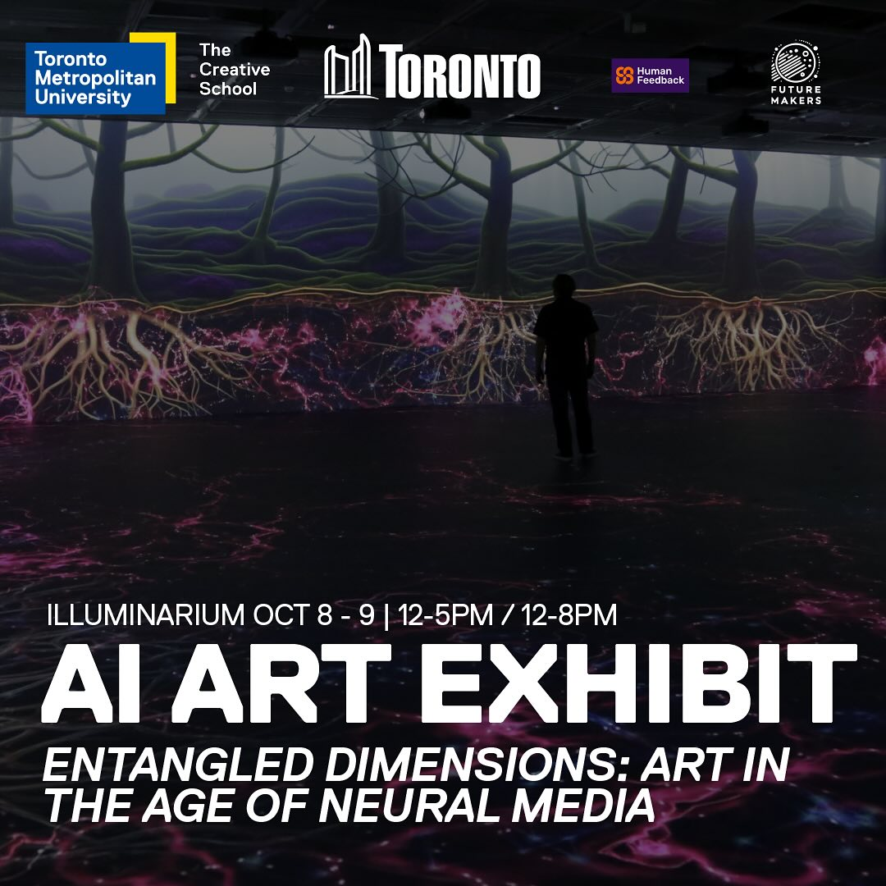

# DIGM5010 Foundations of Digital Media

Thursdays, 1.30pm-4.30pm, Fall 2024, Fine Arts building room ACW 102

**Instructor:** [Graham Wakefield](https://ampd.yorku.ca/profile/graham-wakefield/) grrrwaaa a t york u do t ca

**Hello and welcome!**

## What is DIGM 5010 "Foundations"?

**Synopsis:** The purpose of Foundations is to equip and assist students to undertake **graduate-level research** in **Digital Media**. 

DIGM5010 is foundational core course in the [Digital Media Graduate Program](https://www.yorku.ca/gradstudies/digitalmedia/) (MA/MSc/PhD), co-organized by the [Department of Computational Arts](https://computationalarts.ampd.yorku.ca) in the School of the Arts, Media, Performance & Design, and the department of [Electrical Engineering and Computer Science](https://lassonde.yorku.ca/eecs/) in the Lassonde School of Engineering, York University.

> "The Graduate Program in Digital Media provides highly qualified students with the opportunity to do specialised hybrid research work in a program that uniquely combines computational science and artistic practices. Work in digital media focuses on a broad range of current and emerging forms of digitally supported media, with applications that range from computer games to interactive art."

> The Digital Media graduate program's academic objectives include promotion of an interdisciplinary approach to computational art-making and technology development, providing students with 21st century “real-world” skills in tandem with research acumen. To work and conduct research in this area means skillfully bridging literacies in art, science and engineering practices. 

Developing these research literacies is what DIGM5010 is all about. 

The goals of the *Foundations* course are therefore:
- to learn the essential methodological skills of graduate-level research in areas of digital media and computational arts
- to develop deep understanding and a real feel for computation as a creative medium, 
- to develop the skills to attain literacy in mathematical, theoretical, and computational bases as they intersect with worlds of digital art-making,
- to be able to adequately place your research within a larger network of relations and lineages, and to be able to articulate its relevance and identify its values in context.

This means:
- being aware of the broad range of the field along with its nearer and farther histories, narrow and broader presents, and implicated or possible futures,
- being able to find, read, and understand the languages through which research is articulated, in both theoretical and practical terms, 
- being able to create work across of a broad range of digital media that is effective and/or innovative.
  
Establishing these foundations is ultimately evaluated through the potential to understand, transfer, and extend published research in these fields into new creative applications, recreating or mutating established research results, projects, or works to the specific interests of your research area(s) and creative domain(s). 

*(Reading, writing, making!)*

**Format and evaluation** 

Each weekly meeting will vary in format, but always at the heart is the discussion between all of us. This isn't a course with a static syllabus of material -- it is an adaptive living system. 

In the early part of the course the instructor may bring lecture material or assign readings or research tasks; and we will often dive into collectively coding or algorithmically reconstructing and reinterpreting work drawn from the literature, nestling theory in practice. You are also expected to bring work to share, **making things** in response to our discussions and course topic. You should be keeping your notes, studies and practices documented in a **public journal**. (Class participation, making and journalling make up the first 25% of the course grade.)

[You can submit codepen sketches through this form](https://docs.google.com/forms/d/e/1FAIpQLSdUCztWAi-z4x5r_RTXhsWnvqiw46hPZRIh7eqChm7FGoFGqQ/viewform?usp=sf_link)

As this goes on, each of you will develop a focus on a specific topic to research in depth, leading to a project documented in a research paper. The project's goal is to functionally reproduce and/or interestingly mutate work from the research community and literature. 
  - It will be grounded through an **extensive literature review** (25%),
  - will demonstrate your foundational computational literacy and ability to understand and transfer research into creative applications (25%),
  - and will be documented in **a research paper** with scholarly citations **suitable to submit to conferences or other appropriate venues** (25%).

We will go through draft processes and a simulated conference submission and review procedure later in the course to help understand academic research structures and refine your work. In the past years, some students have also been successful in submitting their final papers to real academic conferences.

**Online resources**

Almost everything about this course will be linked from https://alicelab.world/digm5010 -- bookmark this URL!

Previously we have also used a Microsoft Teams account for sharing file materials etc., but I have found it somewhat unreliable/unstable and I am open to alternatives if there are good suggestions.

**Remote participation**

Regardless whether we are meet in person or remotely, I usually prefer to open a Zoom session for my classes, and use share screen for the most part. 
- [Zoom meeting (same link every week)](https://yorku.zoom.us/j/91019623418?pwd=75h0gYM5Je5nz5Pzbi2vGmWb3G96j4.1)
- [Add it to your calendar (.ics file)](https://yorku.zoom.us/meeting/tJUtduCurDguG9ygI0mac22YuOOK5vLzj_wb/ics?icsToken=98tyKuCprjojHNaWtBiPRowcAoj4Xe7zpnZbjfpEmza1DiFQMFHPI81tGedpPMLa
)

I normally also record all sessions and share recordings with the course participants (so long as no participants have objections to this), as I have heard that it has been useful for many students to be able to review sessions after class hours, including when, due to factors outside their control, they could not attend in class time. *Synchronous attendance is highly recommended given the importance of critical discussion on the development of your studies in the program and your research/research-creation; but if you are expecting challenges in attending all times please do not worry. Having the sessions recorded alleviates some inevitable challenges of the graduate situation, and moreover allows some time to review any material if it seemed to fly too fast. You are all coming from different backgrounds so this is also inevitable.*

----

*Note: The [grading scheme for graduate study at York](https://gradstudies.yorku.ca/current-students/regulations/courses-grading/) is as follows: 90+ A+ (exceptional), 85+ A (excellent), 80+ A- (high), 75+ B+ (highly satisfactory), 70+ B (satisfactory), 60+ C (conditional), <60 F (fail) or I (incomplete).*

-----

# Week 0 
Sep 5, 2023

**Hello and welcome!**

We are in a program of digital media, co-run by computational arts and computer science. Art & science as "two cultures", meeting through a cybernetic medium of computation. 

But perhaps "meeting" is too gentle a word. Sometimes it feels like a tectonic collision. To discover something new, we cannot follow a single path. Collisions between trajectories derail and open into new possibilities, that wouldn't be found if you only followed trend lines or deductive trails. 

So, be comfortable to get out of your comfort zone. Learn from each other. It's OK to be awkward. Children are the most awkward, and the fastest learners, so let us be children again from time to time -- so long as we work hard at it! 

So for example, what does "computation" mean to you?

---

Deep dive: [What is computation?](automata.html) - History, theory, implementation; programs as data

---

## A question

Take some time to think about this: 

- Why did you want to study in the Digital Media program -- why do you want to dedicate several precious years of your life to research in computational art & science -- what does this mean for you? Is there a great risk, or a great unseen opportunity, in the computational/digital media world -- present and future -- one that also speaks to you?

[Write into the form here](https://docs.google.com/forms/d/e/1FAIpQLSdGbObBWxsQpDoewMLRYDhqJ16EJEsZbbbrpbnNrNkN2u03EA/viewform?usp=sf_link)

## An introduction

Please add 2-4 slides to introduce yourself in The Google Slide deck here: https://docs.google.com/presentation/d/1lvAaIH7lXHz0sc02L7JXVsM_QySOY4SPPdc5tNI5HC4/edit
 - I suggest a brief (~100 words) of your background and the key words/ideas/questions for your work, with representative images/video etc. 
- You can include a more formal bio, or artist statement, or something more informal about the inspirations that brought you to the program.
- Remember to include your name, and reference details (name, link etc.) for any images or media you add.
- Please be careful not to delete your colleague's slides!

## A reading

I said in class we should look at others’ Masters & PhD theses/dissertations for inspiration. Here’s the Masters thesis of Golan Levin, from when he was a student at MIT. He is now a professor at Carnegie Mellon University, and a key figure in the Art & Code community. There’s a lot to draw from this thesis, both theoretically and practically. Have a good read and bring some thoughts and questions for next week:
http://www.flong.com/archive/texts/publications/thesis/index.html


----

# Week 1 
Sep 12, 2023

[Introductions](https://docs.google.com/presentation/d/1gukRi55omVeeQcjFBdKagZdfs3_pPLlhgsHfG1go4DU)

## Computational sketching

A futorologist said to me: to understand the future, we must go much further into the past; to see patterns that recur and trajectories behind the present. However this doesn't mean entering the future through a rear-view mirror (McLuhan's warning); it is to understand the language and concepts we see the world in today, and see their gaps and limitations. So it can be helful sometimes to step into the shoes of those that have gone before, to see how we ended up here, and what we may have lost or missed along the way. 

Take [John Maeda](https://en.wikipedia.org/wiki/John_Maeda), the designer & MIT Media Lab professor, who pioneered reactive graphics in the era of the Macintosh and CD-ROM. 

> **Design By Numbers (John Maeda, 1999)**   
> "Drawing by hand, using pencil on paper, is undisputedly the most natural means for visual expression. When moving on to the world of digital expression, however, the most natural means is not pencil and paper, but rather, computation. Today, many people strive to combine the traditional arts with the computer, and while they may succeed at producing a digitally empowered version of their art, they are not producing true digital art. True digital art embodies the core characteristics of the digital medium, which cannot be replicated in any other.
> 
> "Computation is intrinsically different from existing media because it is the only medium where the material and the process for shaping the material coexiist in the same entity: numbers. The only other medium where a similar phenomenon occurs is pure thought. It naturally follows that computational media could eventually present the rare opportunity to express a conceptual art that is not polluted by textual or other visual representation. This exciting future is still at least a decade or two away. For the moment, we are forced to settle with society's current search for true meaning in an enhanced, interactive version of the art that we have always known."

Maeda studied with Muriel Cooper and Paul Rand, and redefined the use of electronic media as a tool for expression by combining computer programming with traditional artistic technique, which helped lay the groundwork for interactive motion graphics as seen on the web today.

Other key insights from Maeda's interactive graphics explorations:

  - the most **interesting** pixels on the screen are the mouse
  - the mouse represents not just **space** but also **time** -- use it

Maeda's courses and research in the Aesthetics & Computation group at MIT inspired a whole generation of creative coders. He taught Casey Reas and Ben Fry, and his [Design By Numbers](https://en.wikipedia.org/wiki/Design_By_Numbers) software was the precursor of their Processing (and thence [P5.js](https://p5js.org/)). 

Maeda's courses challenged students to rethink the medium from its most basic elements. A typical assignment:

> Given a point in space over a finite rectangular area, create a parametric drawing that illustrates repetition, variety, or rhythm. [MAS 964 P](https://acg.media.mit.edu/courses/mas964/presentation/panels.html)

Golan Levin was one of Maeda's students, and went on to focus specifically on the creation of audiovisual instruments, responding directly to Maeda's project. (For example, look at Curly and [Yellowtail](http://www.flong.com/archive/projects/yellowtail/index.html).) He is now a professor at Carnegie Mellon University, and a key figure in the Art & Code community. There’s a lot to draw from this thesis, both theoretically and practically. http://www.flong.com/archive/texts/publications/thesis/index.html -- what were your thoughts and questions after reading this?  (Also note the document structure.)

-----

## Let's get making

- A shareable workspace: [codepen](https://codepen.io)
- The HTML5 trio: the HTML (DOM), CSS, and JavaScript
  - HMTL: the page container and structure. The language forms a **declarative** data structure, roughly in a tree structure. 
  - CSS: the rules of layout, rendering and style. The language forms a set of **declarative** definitions. 
  - JS: dynamic generation and behaviour. The language forms **procedural** steps of action, invoked in response to events. 
- [Javascript](https://github.com/worldmaking/worldmaking.github.io/wiki/JS-notes) 
- What is an API? 
  - E.g. the MDN [canvas documentation](https://developer.mozilla.org/en-US/docs/Web/API/Canvas_API/Tutorial).  Canvas is a rectangular object in an HTML page, suitable for static and dynamic 2D or 3D graphics rendering.
- 2D drawing in the web using [Canvas, vectors, matrices](https://github.com/worldmaking/worldmaking.github.io/wiki/JS-Canvas,-Vector,-Matrix-etc.-notes) 

---

https://codepen.io/grrrwaaa/pen/yLdrXNQ

---

https://codepen.io/grrrwaaa/pen/Yzdxwgj

-----

Can you continue by drawing an example from Golan Levin's research-creation thesis?


# Week 2 
Sep 19, 2023

- Online class today: - [Zoom meeting link](https://yorku.zoom.us/j/91019623418?pwd=75h0gYM5Je5nz5Pzbi2vGmWb3G96j4.1)

## What is Research?

Deep dive [presentation](research.html) & discussion

-----

## A Call for Papers

Through this course you will write a research paper and take it through the process of literature review and development, drafting a paper in response to a call for research, and peer review and completion thereof, modeled on real processes of academic research publication.  The call for papers we will use is adapted from calls for the [SIGGRAPH Art Papers](https://s2024.siggraph.org/program/art-papers/) and the [ISEA (International Symposium on Electronic Arts)](https://isea2025.isea-international.org/submission/submission-guideline/). 

- Note that ISEA 2025 (Seoul, Korea) has a deadline of 15 November 2024 -- if we can move quickly enough in the course you could submit to it! 
- Siggraph 2025 will be in Vancouver, but (as of writing) the submission deadlines are not yet published. It might be between January to March. 

*(Broad terms of call, with theme(s) and topics)* 

The "DIGM Computational Art Symposium" acts as a bridge between art and technology to rethink and explore our future. The dream is to bring art and engineering communities together, as has been so fruitful in history. We understand art in its broadest sense, encompassing different fields from fine art to design and architecture. Submissions exploring how computer science and interactive techniques — especially those linked to recent developments — that relate to questions of the future are particularly encouraged. We encourage submissions that discuss and explore within the fields of electronic arts, creative technology, digital culture and all manners of art-science-technology collaboration not yet born. We would like you to engage in the Renaissance of the 21st century!

Topics of interest include, but are not limited by:

- All modes of augmented, mixed, extended and virtual realities from interactive digital worlds to metaverse
- Art-science collaborations and practices
- Bio-art and artificial life
- ‘Bleeding edge’ concepts from art-science-technology
- Computational media art as a critical and constructive intervention to the ongoing construction of social reality
- Creative robotics and human-machine partnerships
- Data visualization, sonification, data arts
- Explorable explanations: complex ideas conveyed through interactive experiences
- Indigenous futures
- Machine learning as a co-creator
- Media art archiving
- New approaches to computational art research and creative practice-based methodologies
- Posthuman, transhuman, and ’more than human’ paradigms
- Theories of post-image, new aesthetics, and computer vision
- Transmedia storytelling

*(Submission categories)* 

Prospective authors may consider one of the following categories as they prepare their work for submission.

- **Projects and case studies.** Papers in this category rigorously document a realized project that combines computational techniques with creative practice. They also critically explore its social, cultural, and affective impact.
- **Methodological contributions.** Papers in this category identify, document, and explore emergent methodological approaches that open new pathways to the practice and scholarship of computational art and/or engineering development as well as art-engineering collaboration. This could be in the form of a "white paper" about a new technique. 
- **Reproduction of research.** Re-implmeent a known and significant research paper, and analyze the results. 
- **Innovation through art practices.** Papers in this category explore, through artistic practice including technology development research, the potential use of emerging digital technologies and their impact for users and citizens. They may also express a transdisciplinary work between digital engineering and art practices to develop solutions that confront the major challenges of our times.
- **History, theory, and criticism.** Papers in this category offer new technically-informed historical, theoretical, and critical perspectives on computational art and on the technical artifacts, infrastructures, and communities that support them.
- **Novel approach to literature as manifesto.** Discuss more deeply ideas encountered in the bibliography as the basis for a foundational manifesto. Include both the discussion/argumentation as well as the resulting manifesto in the submission.
- An **Explorable Explanation**. Inspired by the [Explorable Explanation](https://explorabl.es) website, you can either
  - a) present a new topic that could be represented and conveyed more effectively as a dynamic system, and in your paper discuss the design and implementation of it, or
  - b) choose one of the systems in [Explorable Explanations](https://explorabl.es) and first offer a critique and second attempt to reproduce it, as an example of replicating research. Document what you observe, e.g. how it (meaningfully) differs (if it does), comparing related work, discussing what new avenues you find or suggest. 
  - In either case don't concern yourself with a slick design, concentrate on what are the core mechanics of the idea, and how they convey an otherwise difficult subject.

*(Paper requirements)*

We invite paper submissions for original and substantial research, both traditional and non-traditional, that has not been previously published. Papers will follow full academic practices, through an extensive literature review, argumentation, and observations or evaluations of impact. All papers must follow academic standards and will undergo blind peer review based on quality, relevance, originality, and impact. 

(See notes on the [Final Paper submission](#final-paper) for details about formatting.)

Submissions will be uploaded online. We also ask you to add a very short text explaining why your submission is important for the academic and wider community, from raising critical issues to opening perspectives or generating solutions. In doing so, we aim to enhance the impact of your cultural contributions.

Authors will be required to present their papers with a duration of 10 minutes. 

-----

## Preparing a Reading List

As the first step in this process, you will begin with preparing a collection of papers related to your research topic/question.

**Literature review part 1: Reading List**

In this course you will investigate a topic within a sub-area of the digital media realm that intersects with something of value to your own research goals in the program. 

In the first phase you will build up a **reading list** on your chosen topic. Please create an online document that you can share (e.g. a github page, a google doc, etc.) to collect your notes and references as you develop this reading list.

As we saw in class, good research needs a good research question, but that doesn't always become apparent at first. Start wider until you are ready to go deep & narrow. Seek out key papers, conferences, and other key resources for the topic. 

- Some investigative tips:
    - Use Wikipedia to identify **keywords or terms**, questions and issues, foundational publications and controversies, etc. This can also help to make your search more narrow/specific. Look for the edges of a body of research. Wikipedia is an excellent network of conceptual nodes (but also a potential rabbithole). But remember that it is an encyclopedia, and should be used mainly as a guide map.
    - Use these terms and publications in [Google Scholar](https://scholar.google.com/), [Zotero](https://www.zotero.org) and other academic search engines to find for papers that address the questions and issues. Follow `cited by` and `related articles` trails to find new leads. Aim to find the most significant (qualitatively & quantitatively) papers. You should be aiming for a collection of 25-50 potentially interesting papers on the topic at this point. 
    - At the same time, look for conferences or journals that are more specific to your topic, and see if they have collections of proceedings online to browse through. 
    - Not all papers are available as PDFs online. You might be able to find them via [York Libraries](https://www.library.yorku.ca/web/bbl/e-resources/) or also communities like [ResearchGate](https://www.researchgate.net/), but do not let this roadblock your progress -- find alternatives to work from instead.
    - At this point you may be able to formulate a first draft of a title of the topic or area, perhaps even a key question or problem statement; but don't worry at this stage if you haven't yet.
  - Collect this list as a **Reading List** along with:
    - The specific topic title or
    - The keywords or search terms
    - The work-in-progress research question/problem statement/abstract

- [York off-campus library access](https://www.library.yorku.ca/web/ask-services/printing-and-computing/computing/off-campus-access/)
- [York VPN links](http://www.yorku.ca/computing/vpn-choice.html)


----

## Making 2: animate drawing

Let's continue from last week's drawing app. 

> First a quick note -- what we are doing looks a bit like p5.js. In fact, if we remember to refactor code that we will re-use into re-usable functions, then it might start to look even more like p5.js -- maybe we will have `line()` and `background()` etc.  That's good: we are in the stage of *reproducing research*. And if we find there are moments where we want to do things a little differently, because of the needs of our project, that's good too -- we aren't limited to what's already given because we know how to remake it, and maybe we'll have a discovery that can advance research! 

- We saw how we can draw in response to mouse/touch movements, and add generative variation to them. 
- We talked about Maeda's comment "the most interesting pixels are the mouse" and this represents not just space but also **time**. How can we use the timing of a drawing gesture to modify the result? Can you think of ways to use speeds, rhythms, echoes, ?

  - Can we *reify* the time of the gesture?

A more complex example, inspired by Paul Haberli's *Dynadraw*: 

https://codepen.io/grrrwaaa/pen/gOYQyrd?editors=0010

[Today's script](https://codepen.io/grrrwaaa/pen/GRbVYrw?editors=0011)


# Week 3 
Sep 26, 2023

[Zoom recording](https://yorku.zoom.us/rec/share/XAq2NPYpbqCVBtvR9gTmcTZspvcMPikuRRy7-m0ibmowUEfFi0B7Sp_LxRO3fScy.up7ZoH5Adud0amiq)

- Reading list discussion

## Reproducing Curly/Yellowtail

  - Last week we saw how we can make animations through an erase/draw loop, demonstrated by drawing random lines on each frame. But these have no consistency from one frame to the next. How can we add consistency?
  - Or: how can we combine both sketching and animating? How can we draw a line that then animates?
    - Can we *reify* the drawing?

With these steps, we should be in a position to attempt to reconstruct Golan Levin's Curly/[Yellowtail](http://www.flong.com/archive/projects/yellowtail/index.html), for example. 

**This is an example of reproducing research.**  First we should sketch out what is required based on the source material, and work from there to refine from a sketch through pseudo-code and implementation of components until we have the final result. 

> "Yellowtail repeats a user's strokes end-over-end, enabling simultaneous specification of a line's shape and quality of movement. Each line repeats according to its own period, producing an ever-changing and responsive display of lively, worm-like textures."

Detailed description from page 73 of the [thesis](http://www.flong.com/archive/storage/pdf/articles/thesis300.pdf):

> "a user’s linear marks transform into an animated display of lively,
worm-like lines. After the user deposited a mark, the system
would then procedurally displace that mark end-over-end, making
possible the simultaneous specification of both a line’s shape as
well as its quality of movement. Straight marks would move along
the direction of their own principal axes, while circular marks
would chase their own tails. Marks with more irregular shapes
would move in similarly irregular, but nonetheless rhythmic
patterns."

> The " screen space obeyed periodic (toroidal-topology)
boundary conditions, such that marks which crossed the edge of
the screen would reëmerge on the screen’s opposite side, rather
than disappearing altogether."

Notice also the self-observation and critique, see p79. Although this project does not achieve the goal of the thesis, these observations inform the progress that follows. This is a positive research path. 

---

OK so let's start by pseudo-coding Yellowtail!

Here's what we ended up with as pseudo-code in class, before we started coding:

```
there is a canvas

state:
	mouse: x, y, buttonstate
	time
	currentpath = null
	list of finished paths
		start position
		list of segments (dx, dy change vectors)

pointerdown:
	create a new currentpath object, with start position at mouse x,y & t

pointerup:
	if currentpath
		add my currentpath to the list of finished paths
		currentpath = null again

pointermove:
	if currentpath exists
		add mouse dx,dy & t to currentpath's list of segments

animate:
	for each path of finished paths
		remove 1st segment (shift)
		(something about coordinates)
		stick it onto the end (push)
		wrap around canvas width/height 
			e.g. if x > width; x -= width, etc. for 4 boundaries

drawpath:
	begin position at path's start position
	for each segment of the path
		line from last position to new position by adding segment change
		(path, moveto, lineto, stroke)

draw:
	clear screen
	for each path of finished paths
		drawpath(line)
	if currentpath exists
		drawpath(currentpath)
```

And here's the final code we ended up with, with a couple of little refinements added:

https://codepen.io/grrrwaaa/pen/vYoOLqL?editors=0010

Please continue working on extending and mutating this into a new direction! We will share each other's codepens in the next class. 
- We talked about how these lines are still fairly passive, as they just follow the series of instructions given to them by the initial gesture. How could they become a bit more autonomous?
- Each segment holds a relative change. Can we do something interesting with that?
- Are there more interesting things we could do with the boundaries?
- Should segments continue forever? 
- Each segment holds a relative time, but we aren't really using that in the animation yet. E.g. if you pause mid-gesture, then continue, the animated line moves but it does not have a pause. Can you figure out how to fix that?
- There was a good suggestion in class: with multiple lines, they are not aware of each other. Is there a way that they could be?
- How about time -- is there a way to synchronize them to an underlying meter, for example?
- Or if you want to try to figure it out, how would you add sound to each line?

---

[past version 1](https://codepen.io/grrrwaaa/pen/jOXYdMd?editors=0010)

[past version 2](https://codepen.io/grrrwaaa/pen/aagQzY?editors=0010)

---

Some rules of thumb while coding:

- Use the simplest limits you can -- e.g. limiting yourself to drawing only black lines. More colour, shape and style variations can always be added later. Let's focus on behaviour first.

- Break a problem down into sub-problems. Approach the problem from a simpler approximation first -- the simplest version. E.g. make it work in a static way before a dynamic way, or make it work for one, before making it work for many, etc.

- Try to work out a problem in pseudocode first -- just write it in commments, draw it on paper, etc, any form that is concrete will help to see the problem more clearly, and diving head first into code isn't often the right thing to do. Once the method becomes clearer, start converting pseudocode into "minimum viable" code.

- Use event handlers (draw-frame, mouse, keyboard, timers, ...) to animate and interact with things. 

- Figure out working conditions logically from basic requirements. E.g. for anything to animate we're going to need to clear the screen on each frame, which means we're going to have to redraw everything every time, which means...

- Use state (variables for numbers, strings, objects, arrays) to make things exist over time. Once captured, data can be replayed, modified, etc. Often you can represent state in a few different ways, and the choice will make some processes easier than others.

- Test often. Each time you add one minor element, make sure it works for all likely input. 

- Handle special cases: starting values, boundary cases, error handling... 

- Don't worry about trying to make anything optimal -- make the most naive way that works, then refine from there. 

- Use abstractions (functions, objects) to encapsulate and structure ideas more easily & clearly. Any time you feel like you are writing the same code several times, replace it with a function or loop. Separate out reusable "support routines" from the code that represents the main ideas. 

- Comment the code and use good variable names -- you'll thank yourself in the future when you come back to it! (And anyone else looking at the code will thank you more -- remember research is about sharing!)

- Take notes as you go. At any time you might have an idea of a different direction to explore -- you can only do one at once, so write them down! Even if they are just comments in the code.

- Make many copies, saving a version (in Codepen you can do this via a Fork) for each minor milestone. If it goes wrong but in an interesting way (a happy accident), save a version of that too.

----

## Machine intelligence and autonomous agents

One of the most timely topics of focus today is that of machine learning and artificial intelligence, and particularly now the cohabitation of human/biological and machine agents and intelligences in the world. 

For instance, York University recently established [The Center for AI & Society](https://www.yorku.ca/research/cais/) organized research unit, and was awarded $80M from federal funding for the [Connected Minds](https://www.yorku.ca/research/connected-minds/) program. See the [announcement here](https://www.yorku.ca/news/2023/04/28/york-university-leads-318-4m-first-of-kind-inclusive-next-gen-technology-research-initiative/). There will be many multidisciplinary projects funded through this, for which you might be hired as research assistants. There will be scholarships for graduate students (and post-doctroral research appointments) through this, to which you may apply. 

What are the research questions, and especially, what can our field contribute? Where does this overlap or intersect with *your* interests? How will you articulate this?

For the purposes of our DIGM5010 course: what are some of the **foundations** of our field that may inform this?

Slides: [Tortoises, turtles, robot flocks and vehicle societies](agents.html)

Reproducing research: [Steering behaviours for vehicles and flocks](steering.html)

**References**
- [Papert, Seymour A. Mindstorms (Excerpts)](https://drive.google.com/drive/folders/1nUFDBRNpvKXp3-JiYwBIuN0a55T4vb-Y) 
- [Braitenberg, Valentino. Vehicles. 1984](https://drive.google.com/file/d/1FcBQEl6E3hvNy3q-ow4HaFn2jtOPaxvA)
- [Alan Kay. Marvin Minsky & The Ultimate Tinkertoy](https://tinlizzie.org/tinkertoy/)
- [Craig Reynolds. Steering Behaviors For Autonomous Characters, Game Developers Conference. 1999](https://www.red3d.com/cwr/steer/gdc99/)


# Week 4
Oct 3, 2023

**News about an exhibition next week**

[](https://www.instagram.com/p/DAjS88aSAlT/?fbclid=IwY2xjawFo4KtleHRuA2FlbQIxMAABHQI92JyX-yxVum1eUtR5RRSeETmgu2OIj3BLExtiknkv4oTbeMeXuqPf0g_aem_NHutBsopKfT8WwBFJ2V79A&img_index=1)

[Entangled Dimensions: Art in the Age of Neural Media](https://www.eventbrite.ca/e/entangled-dimensions-art-in-the-age-of-neural-media-tickets-1034058876937#:~:text=Presented%20by%20Future%20Makers%20in,digital%20and%20neural%20media%20art.) at [Illuminarium](https://www.google.com/maps/place/Illuminarium+Toronto/@43.64993,-79.3631862,17z/data=!3m1!4b1!4m6!3m5!1s0x89d4cb80a6a8c87b:0x2c884e51f04efab!8m2!3d43.64993!4d-79.3606059!16s%2Fg%2F11svk7p37t?entry=tts&g_ep=EgoyMDI0MDkyNS4wKgBIAVAD), Toronto
- Oct 8: 12:00 PM - 5:00 PM
- Oct 9: 12:00 PM - 8:00 PM
 
This immersive exhibition explores the intricate connections between human and non-human intelligences through digital and neural media art.
Curated by Ryan Kelln, we invite you to experience the work of Toronto-based artists and dive into a world of cutting-edge art featuring AI-driven creations, EEG/brainwave-powered pieces, 3D-printed marvels, and other pioneering forms of digital expression.
 
Featured Artworks / Artists:
 
- *We Are Entanglement*, Artificial Nature: Haru Ji & Graham Wakefield
- *Living Sculptures*, Vladimir Kankc (@vladdkanic ) 
- *(ex)tending towards*, Jane Tingley (York University)
- *The Wail*, Wilfred Lee (@theartistsjourney )
- *IWTBNA: I want to be new again*, Nava Messas Waxman (@navawaxman_m )
- *what abides*, Ben McCarthy (@paleeyesmusic)
- *Blue Dot (Shadow)*, Evangeline Y Brooks
 
Presented by the collaborative initiative of @thecreativeschl and @cityofto Creative Technology Office - Future Makers Collective and the Human Feedback Foundation.
 


## Explorable explanations

- [Explorable Explanations](https://explorabl.es)
  - For example, [The Wisdom and/or Madness of Crowds](https://ncase.me/crowds/)
  
- [Continuing with steering behaviours](steering.html)

---

Begin developing your readling list into an **annotated bibliography**

---

## Annotated Bibliography

- From your reading list, select at least 8 item to study in more careful detail as you create an **Annotated Bibliography**. 
  - Use skimming/speed reading and organization to identify those that are most interesting or most worthy of more detailed review; and which would constitute an adquate treatment of the topic. 
  - Aim for diversity. Avoid using the same authors for the majority of the selection. Include distinct and opposing viewpoints if possible. 
  - Use primary sources where possible (in particular avoid blog posts, news articles, etc.), unless the secondary source adds a significant new idea (in which case you may want to cite both).
  - Not everything has to be an academic paper, but ensure that at least 75% of your references are academic publications (conference articles, journal articles, etc.). 
- Once your list is shortened, perform a deep read of each one, taking notes as you go. The annotation for each paper could typically be 200-500 words. 
  - I recommend highlighting PDFs but taking notes in a separate plain text document. 
  - Don't note everything, focus on what the key points are to get a condensed overview of the whole paper. (A well-written paper makes one main point per paragraph, and not all points are significant.)
    - Distinguish clearly between 
      - what is a summary of the paper, 
      - what is a quotation from the paper (use quotation marks), 
      - and what is your own thought in response (you could use (parentheses) or [square brackets] to indicate these). 
    - Note page numbers in the text document as you take notes. 
  - See [York SPARK's guide to annotated bibliographies here](https://spark.library.yorku.ca/wp-content/themes/glendonits-spark-20151125/resources/Annotated%20Bibliography%20Overview.pdf). 
  - However, unlike the format and examples in that guide, I support and encourage bullet-point style summaries.
  - I also encourage you to copy out any specific quotations that you find significant, inspiring, or which neatly summarize the authors' points. 
- After deep note-taking on each paper, read them again with your notes, and correct any mistakes or misunderstandings, amend your analyses, and note any new thoughts. This is your **annotation** for each paper. 
- [You can submit the Annotated Reading list in this form, including](https://forms.gle/dw2CuCxeAnHWRJ2u6)
  - The specific topic title or
  - The keywords or search terms
  - The research question/problem statement/abstract
  - Your initial Reading List
  - Your final Annotated Bibliography
  - Any meta-commentary on observations you found while researching the topic that are not specific to any one paper -- in particular, did you find a "gap" in the treatment of the topic that could be an important avenue for your own work?
- The final deadline for submission is **Sunday Oct 13th**.

<!--
- [Zoom recording](https://drive.google.com/file/d/1_yZch7K50LojaVojQeUDublwyVCf5GAh/view?usp=sharing)

---codepen:https://codepen.io/grrrwaaa/pen/mdaoRKa
---codepen:https://codepen.io/grrrwaaa/pen/LYMayEE
---codepen:https://codepen.io/grrrwaaa/pen/PoXLmVe
-->

# Week 5 
Oct 10 

- Review of schedule for remainder of semester
  - The research paper (which can be a continuation of your bibliography and/or codework)
    - The final submission
    - The call for papers
    - The peer review
  - The video tutorial (which can support your paper)

- Complete your annotated bibliography
- **Annotated bibliographies due Sunday Oct 13th**

- Next week is reading week -- a perfect time for you work on your paper's first draft! 
  
- Sharing & discussing work so far

- 1-on-1 Q&As

- Continuing exploring code sketching

---

# Week 6
[Reading Week]

- Work on your paper draft for the peer review session

---

# Week 7
Oct 24, 2023

- Sharing & discussing, writing & code

<!--
---
[Zoom recording](https://yorku.zoom.us/rec/share/ydBsTO_cShKJr6m4HSosOmmj0JPosbTi1KnZ7rcp16O1mBGwYbFpEUJsuCvRkypY.9L3Y1RsmL0YcwucL)
-->

- Complete your paper draft. It **must be submitted before next week's class** - [submit the paper with this form](https://docs.google.com/forms/d/e/1FAIpQLSecdNzeUZRAiSQcIViboyWTCAxnuyAfphUGJGKy91H9ZKDDPg/viewform?usp=sf_link)

---

# Week 8
Oct 31, 2023

**Make sure your paper is submitted to the link above before this class!!**
  
- Peer review discussion

What qualifies as *good* research? One way of knowing this is to look at how research is *reviewed*. Again, most grant appplications, but also journals and conference review bodies often publish guidelines for reviewers. These are the criteria by which your work will be evaluated. 

- [Wikihow](https://www.wikihow.com/Review-a-Journal-Article) to review an article!
- Guidelines from [Springer](https://www.springer.com/authors/manuscript+guidelines?SGWID=0-40162-6-1261021-0#:~:text=Reviews%20should%20be%20conducted%20fairly,less%20useful%20to%20your%20field.), [Wiley](https://authorservices.wiley.com/Reviewers/journal-reviewers/how-to-perform-a-peer-review/step-by-step-guide-to-reviewing-a-manuscript.html), [Elsevier](https://www.elsevier.com/reviewers/how-to-review)

These are general guidelines, but practices and cultures of value can differ very greatly between different research communities -- and we are often transdiscplinary... 

- Past reviews

- **During class**:
  - Submit your [Peer reviews](#peer-review) to [the peer review form here](https://docs.google.com/forms/d/e/1FAIpQLSeLBcwJXSRJCwpN54hRq7j1hvmryhlkrrE4OqGqazs43qIc9Q/viewform?usp=sf_link)

---

## Peer Review

Recall our slides on [reviewing research](research.html#/36)

We will run an 'internal review' process, emulating what is frequently done in conference submission review processes. Typically this means:

- A call for work (papers, demonstrations, artworks, panels, etc.) is made public.
- Authors submit a draft or extended abstract of a paper (or a proposal for an artwork etc.) by a certain deadline for review, usually using an online interface. 
- Reviews are most often performed "blind" or "double-blind" (that is, reviewers and authors are anonymized).
- Each draft is sent to a handful of reviewers. Members of the review body are usually made up of many previous authors at the conferene. Though a conference may have hundreds of submissions, usually reviewers only have a handful assigned to them. 
- Reviewers complete a review of the submission, usually using an online interface, by a certain deadline. Sometimes a meta-review is performed by a lead jury member of the conference to synthesize the reviews and reach a verdict on acceptance. Sometimes submissions are accepted, sometimes rejected, sometimes accepted but on different terms (e.g. long paper submission may be accepted as a short paper, with requirement to reduce length.)
- These reviews are sent back to authors, along with the accept/reject verdict. Authors of accepted papers must act upon any requirements or corrections identified by reviewers, and may follow further recommendations. Then the final submission is resubmitted with these changes by a new deadline (usually very shortly after receiving reviews).

**For our purposes, you will act as both author and reviewer: each of you will act as reviewers for the other students' submissions.**

For general review guidelines, [see here](https://www.wikihow.com/Review-a-Journal-Article) and [here](https://authorservices.wiley.com/Reviewers/journal-reviewers/how-to-perform-a-peer-review/step-by-step-guide-to-reviewing-a-manuscript.html) or [here](https://www.elsevier.com/reviewers/how-to-review), or [here](https://www.springer.com/authors/manuscript+guidelines?SGWID=0-40162-6-1261021-0#:~:text=Reviews%20should%20be%20conducted%20fairly,less%20useful%20to%20your%20field.). Here are key points:

> "The purpose of peer review is to improve the quality of the manuscript under review, and of the material that is eventually published. Conscientious peer review is a time-consuming task but is essential to assure the quality of scientific journals." 

> Reviews should be conducted fairly and objectively. Personal criticism of the author is inappropriate. If the research reported in the manuscript is flawed, criticize the science, not the scientist. Criticisms should be objective, not merely differences of opinion, and intended to help the author improve his or her paper.

> Comments should be constructive and designed to enhance the manuscript. You should consider yourself the authors’ mentor. Make your comments as complete and detailed as possible. Express your views clearly with supporting arguments and references as necessary. Include clear opinions about the strengths, weaknesses and relevance of the manuscript, its originality and its importance to the field. Specific comments that cite line numbers are most helpful. 

> Begin by identifying the major contributions of the paper. What are its major strengths and weaknesses, and its suitability for publication? Please include both general and specific comments bearing on these questions, and emphasize your most significant points. Support your general comments, positive or negative, with specific evidence.

> Is the aim clearly stated? Do the title, abstract, key words, introduction, and conclusions accurately and consistently reflect the major point(s) of the paper? Is the writing concise, easy to follow, and interesting, without repetition?

> Are the methods appropriate, sound, current, and described clearly enough that the work could be repeated by someone else? Is the research ethical and have the appropriate approvals/consent been obtained? Are appropriate analyses used? Are they sufficiently justified and explained? Are statements of significance justified? Are results supported by data? Are any of . the results counterintuitive? Are the conclusions supported by the data presented?

> Are the references cited the most appropriate to support the manuscript? Are citations provided for all assertions of fact not supported by the data in this paper? Are any key citations missing? 

> Should any portions of the paper should be expanded, condensed, combined, or deleted? 

As a structure, our review is based on materials as used by the [SIGGRAPH Art Papers](https://s2023.siggraph.org/program/art-papers/) review body. That process was double-blind (both authors & reviewers anonymized), but since we know each other, we'll run our review single-blind (authors anonymized). Each of you will be randomly assigned up to 3 papers to review. 

-----

# Week 9
Nov 7, 2023

- **Peer reviews received** 
  - Review outcome & process discussion. 
  - Group and/or 1-on-1 discussion for final paper

- Possible topics: 
  - An introduction to git?
  - An introduction to Node.js?


## Final Paper

1. The final paper continues from the [Literature Review](#annotated-bibliography[), and responds to the [Call for Papers](#the-call-for-papers). 
  - Find a few other papers online that have similar focus, and analyze their structure as a guide.
  - Find related conferences/symposia/journals/etc. to contrast other papers as well as submission and review criteria. 
  - You should identify at least one conference/festival/other appropriate venue to submit your research or research-creation. Investigate papers submitted to this in past years, and the submission requirements and review criteria. 
  - Document these findings in your journal.
2. Papers can range from 2000-5000 words. You have two choices for publication format. 
   1. A traditional conference-style paper. Papers must follow the standard template (adapted from ISEA2024) available [here](https://docs.google.com/document/d/1WZkAN9oaT8pvVVKBRwRRgbwnuKmAU0JJ/edit?usp=share_link&ouid=112275914788197824145&rtpof=true&sd=true) or [here](https://www.acm.org/binaries/content/assets/publications/taps/acm_submission_template.docx)
   2. A very modern, online-first academic article. That is, one designed to be read online, with at least some active components, rather than primarily on paper. The notion of publishing in academia has been rapidly changing, and these changes accelerated during the pandemic.
     - See [https://www.pubpub.org](https://www.pubpub.org) for an example of a modern online-first collaborative publishing venue. Many conferences in recent years have moved over to this format (e.g. NIME, ICLC). 
     - See [https://distill.pub](https://distill.pub) for an example of a modern, web-based peer-reviewed journal with embedded visualizations and interactive components. 
     - See [https://jar-online.net](https://jar-online.net) for a different example more focused on art theory & practice.
     - Alternatively, create your own using github, github-pages, html5/css/js, markdown/pandoc, D3.js, webgl or similar. 
     - Whichever platform is used, the paper should meet academic standards of relevance, clarity of writing, structure, balanced and evidence-based argument, critical thinking, and appropriate level and kinds of academic references. 
3. Post your final paper online to our final submission form here: [https://forms.gle/zHPbsvSrtoA16xzAA](https://forms.gle/zHPbsvSrtoA16xzAA)

Please submit your final papers by December 8th, thank you!!


---

# Week 10
Nov 14, 2023

- Possible topics: 
  - An introduction to git?
  - An introduction to Node.js?

- **For next week**:
  - Submit your [Video Tutorial](#video-tutorial)

---

## Video Tutorial

Research is about *sharing*. Sometimes, that requires sharing *how*. 

1. Create a video-based tutorial (roughly 10-20mins) to introduce a technical topic.
	- It could be an introduction to a platform we are not covering in class
	- or an exploration of a library/API or SDK etc. in Javascript
	- or alternatively, it could be a tutorial on a technique or algorithm or mechanism or a part of mathematics etc.
2. Whichever you choose, it should cover both of: 
	- introducing the key concepts, the unusual and interesting parts, and related work
	- deep-dive developing a demonstration (coding a sketch) from the ground up, explaining via voiceover what you are doing at each step and why. 
3. You are welcome to use any screen-recording tool. Zoom is OK, Camtasia is pretty fancy, OBS is very powerful and free. Whatever you use, I recommend doing a few takes. Sometimes the first take is the best, sometimes the third. You are welcome to edit them together if it makes sense. But don't lose time making it 'slick' -- that's not the point here. People like [Dan Shiffman](https://www.youtube.com/channel/UCvjgXvBlbQiydffZU7m1_aw) or [3Blue1Brown](https://www.youtube.com/channel/UCYO_jab_esuFRV4b17AJtAw) do make beautiful videos but the most important part is that they convey *what* is interesting/valuable/powerful/etc. about the technical system/tool/algorithm/etc by explaining *how* it works.  

---

# Week 11
Nov 21, 2023

- **Video tutorials due**
  - [Add your video tutorial to the slides here](https://docs.google.com/presentation/d/1L8oUYKt1oO6vrxgB36ArqI_stz8U0TyHMAWhnPjafPs/edit?usp=sharing)

One-on-one guidance for papers & presentations preparation

---

# Week 12
Nov 28, 2023

**Final presentations**

We have about 10-15 minutes per presentation, plus 5 minutes for questions & discussion! 

<!--
[Zoom recording](https://yorku.zoom.us/rec/share/99TfEFAgXaklPBZdmx9u5TRDJGjn28DUPJIQZvnImOzhsTCX2GCPkZIAg3N8AhOQ.n4PrI8uAqSOaHr0f)
-->

---

[You can submit all of your codepen sketches as we go along through this form](https://docs.google.com/forms/d/e/1FAIpQLSdUCztWAi-z4x5r_RTXhsWnvqiw46hPZRIh7eqChm7FGoFGqQ/viewform?usp=sf_link). 

<!--

Research step 1: survey the field / [literature review](#literature-review-1)
 
# Week 4
Oct 5, 2023


Places to look:
- [3Blue1Brown](https://www.youtube.com/channel/UCYO_jab_esuFRV4b17AJtAw)
- [Desmos](https://www.desmos.com/calculator) is a quick online grapher
- [Math as code](https://github.com/Jam3/math-as-code) -- how to translate between math notation and JS code
- [Explorable Explanations](https://explorabl.es) -- far more than math! 

[Microworlds](vehicles.html) - [Turtle talk](https://codepen.io/grrrwaaa/pen/KKqJGQK?editors=0010)

**Homework**: choose an Explorable Explanation that relates to your research topic. For practice, try to reconstruct part of the explorable system!


## Literature Review 2 

- From your reading list, select at least 8 of them to study in more careful detail as you create an **Annotated Bibliography**. 
  - Use skimming/speed reading and organization to identify those that are most interesting or most worthy of more detailed review; and which would constitute an adquate treatment of the topic. 
  - Aim for diversity. Avoid using the same authors for the majority of the selection. Include distinct and opposing viewpoints if possible. 
  - Use primary sources where possible (in particular avoid blog posts, news articles, etc.), unless the secondary source adds a significant new idea (in which case you may want to cite both).
  - Not everything has to be an academic paper, but ensure that at least 75% of your references are academic publications (conference articles, journal articles, etc.). 
- Once your list is shortened, perform a deep read of each one, taking notes as you go. The annotation for each paper could typically be 200-500 words. 
  - I recommend highlighting PDFs but taking notes in a separate plain text document. 
  - Don't note everything, focus on what the key points are to get a condensed overview of the whole paper. (A well-written paper makes one main point per paragraph, and not all points are significant.)
    - Distinguish clearly between 
      - what is a summary of the paper, 
      - what is a quotation from the paper (use quotation marks), 
      - and what is your own thought in response (you could use (parentheses) or [square brackets] to indicate these). 
    - Note page numbers in the text document as you take notes. 
  - See [York SPARK's guide to annotated bibliographies here](https://spark.library.yorku.ca/wp-content/themes/glendonits-spark-20151125/resources/Annotated%20Bibliography%20Overview.pdf). 
  - However, unlike the format and examples in that guide, I support and encourage bullet-point style summaries.
  - I also encourage you to copy out any specific quotations that you find significant, inspiring, or which neatly summarize the authors' points. 
- After deep note-taking on each paper, read them again with your notes, and correct any mistakes or misunderstandings, amend your analyses, and note any new thoughts. This is your **annotation** for each paper. 
- Post the results into your journal:
  - The specific topic title or
  - The keywords or search terms
  - The research question/problem statement/abstract
  - Your initial Reading List
  - Your final Annotated Bibliography
  - Any meta-commentary on observations you found while researching the topic that are not specific to any one paper -- in particular, did you find a "gap" in the treatment of the topic that could be an important avenue for your own work?

For example, [here's](https://alicelab.world/digm5010/vehicles.html#annotated-notes) my own annotated bibliography notes on Seymour Papert's Mindstorms.


| Sep 29: [Week 3](#week-3)   | Practice/Review | [Lit Review step 1](#literature-review-1)  |
| Oct 06: [Week 4](#week-4)   | Annotated Bibliographies 
[Explorable Explanations](https://explorabl.es)

| Oct 13: [Reading Week](#reading-week) | | (work on Lit Review step 2)  |

| Oct 20: [Week 5](#week-5)   | What to do next? (Markov, [Time](time.html)) | [Lit Review step 2](#literature-review-2) | [Oulipo Selections](https://drive.google.com/drive/folders/1nUFDBRNpvKXp3-JiYwBIuN0a55T4vb-Y)
| Oct 27: [Week 6](#week-6)   | Project work | [Practice (Journal)](#online-journal--practice-studies) | [Mathews: An Acoustic Compiler](http://ia601505.us.archive.org/7/items/bstj40-3-677/bstj40-3-677.pdf)
| Nov 03: [Week 7](#week-7)   | [Time and sound](time.html)  | [Paper-project abstract](#final-paper) |
| Nov 10: [Week 8](#week-8)   | Papers focus | [Video tutorial](#video-tutorial) |
| Nov 17: [Week 9](#week-9)   | Peer reviewing | [Final paper](#final-paper) [draft for review](#peer-review) |
| Nov 24: [Week 10](#week-10) | [Time and sound](time.html): gen |  |
| Dec 01: [Week 11](#week-11) | | Presentation |
| Dec 10:  | | [Final Paper](#final-paper) |

*-->

<!--
(Oct 12 No class -- York Reading Week)
Oct 19, 2023
Oct 26, 2023
Nov 2, 2023
Nov 9, 2023
Nov 16, 2023
Nov 23, 2023
Nov 30, 2023


Data: 
characters, oulipo to gpt
code is also data
pixels, shaders, 
samples, signals
data art, viz, open data, ...

-----


Implementing Vehicles. Now we need vectors and forces. 


**Make:** Extend / mutate [the code we built in class](https://codepen.io/grrrwaaa/pen/mdwqLqX?editors=0010) 


## Online Journal & Practice Studies

You will create an online journal. If you set up a github repository, you can use the **wiki** feature as a very simple, markdown-flavoured online note taker; or simply create markdown files in the github repository itself. 

Every week, please post an update on your journal, capturing the work you have been doing. The journal as a whole will serve as a documentation of your development in the course. For practice based work, posts should include video, screenshots, embedded scripts, links to github code, or some other concete material. Posts don't need to be long, but should focus on key questions and/or insights discovered along the way. What surprised you? Did you surprise yourself? What are the key challenges you found? We will bring these into the discussion every week. 

This weekly post should include practice studies, such as links to (or embeds of) Codepen scripts. Every week I will share some prompts for these studies. These studies can be relatively simple but should demonstrate something you have learned or document an investigation you have made. Make, make make!

As the course progresses, this journal will capture your progress in development towards the major assignments, which will also be added to the journal. 

-----
## Week 2

[What is research](research.html)?

Research step 1: survey the field / [literature review](#literature-review-1)

[From Vehicles to Mindstorms](vehicles.html)

Sharing code sketches (drawing, vehicles)

[**Zoom recording**](https://yorku.zoom.us/rec/share/DPZrN3q7kWcU6weYwy_n_qQxBMh2s_ck-SRUeEgJTbGsB4kGydGFQSH1C3uZ9ZXv.Uy0rj9H84_W1jUAu) 

Please remember to **email me** with a link to your online journal, including the sketches and notes taken so far, and your literature review/reading list as you develop it!

## Literature Review 1

You will investigate a **topic** that ideally intersects this year's topic/theme (AI) with something of value to your own research goals. Good research always begins by seeking out key papers and other relevant research resources. 
  - Some investigative tips:
    - Use Wikipedia to identify **keywords or terms**, questions and issues, foundational publications and controversies, etc. This can also help to make your search more narrow/specific. Look for the edges of a body of research. Wikipedia is an excellent network of conceptual nodes (but also a potential rabbithole). But remember that it is an encyclopedia, and should be used mainly as a guide map.
    - Use these terms and publications in [Google Scholar](https://scholar.google.com/) and other academic search engines to find for papers that address the questions and issues. Follow `cited by` and `related articles` trails to find new leads. Aim to find the most significant (qualitatively & quantitatively) papers. You should be aiming for a collection of 25-50 potentially interesting papers on the topic at this point. 
    - At the same time, look for conferences or journals that are more specific to your topic, and see if they have collections of proceedings online to browse through. 
    - Not all papers are available as PDFs online. You might be able to find them via [York Libraries](https://www.library.yorku.ca/web/bbl/e-resources/) or also communities like [ResearchGate](https://www.researchgate.net/), but do not let this roadblock your progress -- find alternatives to work from instead.
    - At this point you may be able to formulate a first draft of a title of the topic or area, perhaps even a key question or problem statement; but don't worry at this stage if you haven't yet.
  - Collect this list as a **Reading List**, formatted with MLA, APA or Chicago style as you prefer (but keep it consistent) -- again, Scholar can help source these, but be aware that not all entries are complete. Any non-academic/non-paper references may need special citation styles (e.g. URLs, published films or audio recordings, etc.)
  - Post the results into your journal:
    - The specific topic title or
    - The keywords or search terms
    - The research question/problem statement/abstract
    - Your initial Reading List

- [York off-campus library access](https://www.library.yorku.ca/web/ask-services/printing-and-computing/computing/off-campus-access/)
- [York VPN links](http://www.yorku.ca/computing/vpn-choice.html)

-----
## Week 3

Practice / Review

Places to look:
- [3Blue1Brown](https://www.youtube.com/channel/UCYO_jab_esuFRV4b17AJtAw)
- [Desmos](https://www.desmos.com/calculator) is a quick online grapher
- [Math as code](https://github.com/Jam3/math-as-code) -- how to translate between math notation and JS code
- [Explorable Explanations](https://explorabl.es) -- far more than math! 

[Microworlds](vehicles.html) - [Turtle talk](https://codepen.io/grrrwaaa/pen/KKqJGQK?editors=0010)

[**Zoom recording**](https://yorku.zoom.us/rec/share/ARbKcbdmZykOw61DZ12Uq5W2ALgRpQN8Vso22emu57jmsf4Sfmwp1x0cCra6S_Si.JVycVe4Oy80CPDRk) 

**Homework**: choose an [Explorable Explanation](https://explorabl.es) that relates to your research topic. For practice, try to reconstruct part of the explorable system!

-----

## Week 4

- Sharing Explorable Explanations!
  - [My fireflies](https://codepen.io/grrrwaaa/pen/rNwXydw?editors=0010)

**[Zoom Recording](https://yorku.zoom.us/rec/share/LGURDi70u4a3U4q7ri7IUg89xNPcf5MP00LQ3d4PbGvq7L4mOBSR8-4WGYtpt54Z.Xi-Dv-jrUnppTFkk)*


## Literature Review 2 

- From your reading list, select at least 8 of them to study in more careful detail as you create an **Annotated Bibliography**. 
  - Use skimming/speed reading and organization to identify those that are most interesting or most worthy of more detailed review; and which would constitute an adquate treatment of the topic. 
  - Aim for diversity. Avoid using the same authors for the majority of the selection. Include distinct and opposing viewpoints if possible. 
  - Use primary sources where possible (in particular avoid blog posts, news articles, etc.), unless the secondary source adds a significant new idea (in which case you may want to cite both).
  - Not everything has to be an academic paper, but ensure that at least 75% of your references are academic publications (conference articles, journal articles, etc.). 
- Once your list is shortened, perform a deep read of each one, taking notes as you go. The annotation for each paper could typically be 200-500 words. 
  - I recommend highlighting PDFs but taking notes in a separate plain text document. 
  - Don't note everything, focus on what the key points are to get a condensed overview of the whole paper. (A well-written paper makes one main point per paragraph, and not all points are significant.)
    - Distinguish clearly between 
      - what is a summary of the paper, 
      - what is a quotation from the paper (use quotation marks), 
      - and what is your own thought in response (you could use (parentheses) or [square brackets] to indicate these). 
    - Note page numbers in the text document as you take notes. 
  - See [York SPARK's guide to annotated bibliographies here](https://spark.library.yorku.ca/wp-content/themes/glendonits-spark-20151125/resources/Annotated%20Bibliography%20Overview.pdf). 
  - However, unlike the format and examples in that guide, I support and encourage bullet-point style summaries.
  - I also encourage you to copy out any specific quotations that you find significant, inspiring, or which neatly summarize the authors' points. 
- After deep note-taking on each paper, read them again with your notes, and correct any mistakes or misunderstandings, amend your analyses, and note any new thoughts. This is your **annotation** for each paper. 
- Post the results into your journal:
  - The specific topic title or
  - The keywords or search terms
  - The research question/problem statement/abstract
  - Your initial Reading List
  - Your final Annotated Bibliography
  - Any meta-commentary on observations you found while researching the topic that are not specific to any one paper -- in particular, did you find a "gap" in the treatment of the topic that could be an important avenue for your own work?

For example, [here's](https://alicelab.world/digm5010/vehicles.html#annotated-notes) my own annotated bibliography notes on Seymour Papert's Mindstorms.

## Reading Week

Work on your annotated bibliography and your project!

-----
## Week 5

- News: [AI:Talks series in Digital Media](ai_talks.pdf)


- The question at the heart of an automoton: "what to do next?"
- State machines, [Markov processes](https://en.wikipedia.org/wiki/Markov_chain); text analysis and resynthesis
- Remember [Turtle Talk](https://codepen.io/grrrwaaa/pen/KKqJGQK)
- [Time and sound](time.html)

- Scripts:
  - [Markov text generator](https://codepen.io/grrrwaaa/pen/YzxGxWv)
  - [Markov text generator 2](https://codepen.io/grrrwaaa/pen/YzxWRNx)

**[Zoom Recording](hhttps://yorku.zoom.us/rec/share/aK1K9GIV1o7dndxYPUPEDlcjmyedVQM3JgBhB6t9dJV2iVEz2FK_Rpy7w2AZLdQ.qKbhoPp028yMmKHK)**

- [An example JS library for advanced Markov-driven text analysis & resynthesis](https://github.com/dhowe/ritajs#a-simple-sketch)
  
-----
## Week 6

- Project work
 
Due next week: [Paper-project abstract](#final-paper)

-----

## Week 7

- [Paper-project abstracts](#final-paper) & discussion

- [Time and sound](time.html) continued
  - Music-N, instruments and sequences
  - [In class script](https://codepen.io/grrrwaaa/pen/oNepMZz)
  - [Pre-baked script](https://codepen.io/grrrwaaa/pen/XWajXXM)

Due next week: [Video Tutorial](#video-tutorial)

**[Zoom recording](https://yorku.zoom.us/rec/share/WEje6R6vErTm9yfs_Kkg-qRCfIzq11u66eWiQMS1qfMPS5DoiOwRvSCaeztH0iRd.RtHLq4a01H66xe2O)**

## Video Tutorial

Research is about *sharing*. Sometimes, that requires sharing *how*. 

1. Create a video-based tutorial (roughly 10-20mins) to introduce a technical topic.
	- It could be an introduction to a platform we are not covering in class
	- or an exploration of a library/API or SDK etc. available for one of our platforms
	- or alternatively, it could be a tutorial on a technique or algorithm or mechanism or a part of mathematics etc.
2. Whichever you choose, it should cover both of: 
	- introducing the key concepts, the unusual and interesting parts, and related work
	- deep-dive developing a demonstration (coding a sketch) from the ground up, explaining via voiceover what you are doing at each step and why. 
3. You are welcome to use any screen-recording tool. Zoom is OK, Camtasia is pretty fancy, OBS is very powerful. Whatever you use, I recommend doing a few takes. Sometimes the first take is the best, sometimes the third. You are welcome to edit them together if it makes sense. But don't lose time making it 'slick' -- that's not the point here. People like Dan Shiffman or 3Blue1Brown do make beautiful videos but the most important part is that they convey *what* is interesting/valuable/powerful/etc. about the technical system/tool/algorithm/etc by explaining *how* it works.  

-----
## Week 8

- Discussion about abstracts, final papers, and 
- Peer review preview: 
  - Sharing past reviews (and reviewing)
  - Example: SIGGRAPH Art Papers
  - [The form](https://forms.gle/pWesCCBQkeMKWX6y7)
- Video tutorials

[Final paper](#final-paper) [draft for review](#peer-review)

-----
## Week 9

**[Zoom recording](https://yorku.zoom.us/rec/share/tcnLkfrrxxapfsjmWn15gcox0LM-MYQg8BQVgs3iCLqsFL82eqkj7oa1ruGgeIC1.erXQvut-v6uZlJDP)**

-----
## Week 10

- Time & Sound: gen~
- **[Zoom recording](https://yorku.zoom.us/rec/share/5qPQPGpqXj3_Z0ZKsrRIQ80POnrvI0IPJNYPbGFl6CHngtp2ikOWHgf4QInXwsu4.xCE8R0lMZZfOKCwr)**


-->

-------

