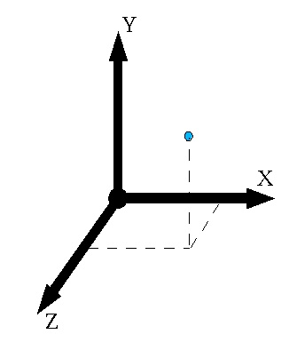
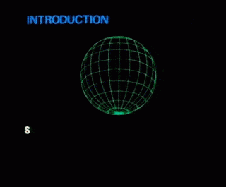
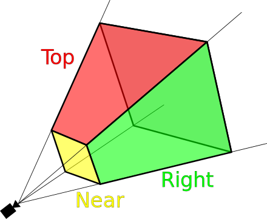
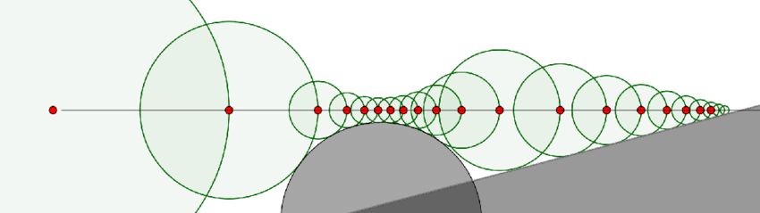

# Space

## Mathematical representation

Computer graphics builds upon Euclidean/[Cartesian](http://en.wikipedia.org/wiki/Cartesian_coordinate_system) foundations, in which a space has dimensions defined by axes centred on an origin. For example, any point in a regular space of two dimensions (2D) may be described by two numbers, for the signed distance (coordinate) from the origin along X and Y axis values respectively. Similarly, in 3D, any point may be described by the triplet (x, y, z). Mathematically we treat the space as a direct mapping of N-dimensional real numbers, R<sup>2</sup> or R<sup>3</sup> respectively. The general term for pairs and triplets (and higher dimensions of grouped parameters) is a *tuple* or *vector*. 

Note that this representation assumes knowledge of the origin and axes, the *coordinate frame* convention of the space. In OpenGL, the standard coordinate convention is right-handed, with positive to the right, Y positive upwards, and Z positive coming out of the screen (toward your eye):



The Cartesian model is not the only possible representation of a space. For example, we can also model the location of a point in 2D space relative to the origin in terms of a distance and angle; the *polar* representation](http://en.wikipedia.org/wiki/Polar_coordinate_system). To extend polar coordinates to 3D space we can use cylindrical (x, y, angle) or spherical (e.g. distance, azimuth, elevation) coordinate systems.

> Note that we also use the term 'space' for parametric, multi-dimensional systems that are not necessarily related to spatial extension as such. For example, we can consider a space of possible colors (perhaps three dimensions of red, green and blue components), or a space of possible joint positions and orientations of a robot arm (with as many dimensions as there are moveable parts), or even a space of possibly very high-dimensional input parameters to a neural network. 

### Spaces and transformations

The coordinate frame we take as the origin is arbitrary. One space may more closely represent perceptual properties, while another more closely maps to hardware representation (e.g. HCL vs RGB representation of color). The meaning of *distance* depends on the spatial representation, and thus also operations of translation, neighborhood and interpolation. Choosing the right space to operate in is very important for the meaning of the result.

Even if we think about regular, 'spatial' space, like the 3D space around us, it can be more useful to work with multiple coordinate frames (multiple "spaces") in a world. For example, it is often convenient to transform into a coordinate system centered on a particular object (such as a character in a game), placing the origin at the object's center and the axes aligned to the object's current orientation, perhaps even scaled to the object's size. Having multiple spaces is very important because certain operations are much easier (or faster) to compute in one spatial representation than another. 

Then we will need a mapping to transform from one space to another. This can be a series of operations. If we have one coordinate frame, which we can all `world`, and other, which we can call `object`, then to transform from world to object we can apply:

- `transate`: move by a vector from the world centre to the object's position, 
- `rotate`: by angle(s) from the world frame to the to the object's orientation,
- `scale`: by relative factor(s) from the world gridsize to the object's gridsize

And vice-versa, to transform from the object's point of view back up to the world's point of view, we can apply the reverse:

- `scale`: by inverse factor back to world grid size
- `rotate`: by reversed angles back to world orientation
- `translate`: by subtracting vector back to world's origin

Note that both the sign of the mappings, and their order of operation, is reversed. 

Often in computer graphics we combine all of these operations into a single transform expressed as a **matrix**. Most programming languages have good libraries for working with vectors, matrices, and so on; for example, in Javascript we can use the [gl-matrix](http://glmatrix.net/) library:

---youtube:kYB8IZa5AuE

Note that the mappings we use in computer graphics extend linear transformations since they also change the position of the origin. In 2D space, a 2x2 matrix represents the coordinate transforms of rotation and scale (and possibly shear) but not transation. But here's a trick: if we embed our 2D space into a 3-dimensional space, we can add a third component to our matrix that represents translation. We then assume that our 2D vectors actually have 3 components, but the 3rd component is always `1`. (And for elegance, and some other purposes, we also add a 3rd column, whose unit vector componets are normally zero and whose translation component is normally 1).

```js
// the components of a 2x2 matrix:
[xx, xy, // X axis unit vector (captures rotation & scale)
 yx, yy] // Y axis unit vector (captures rotation & scale)

// multiply vector [U,V] by this matrix:
u = U*xx + U*yx;
v = V*xy + V*yy;

// the components of a 3x3 matrix:
[xx, xy, 0, // X axis unit vector as above
 yx, yy, 0, // Y axis unit vector as above
 tx, ty, 1] // the translation component

// multiply vector [U,V,1] by this matrix:
u = U*xx + V*yx + 1*tx;
v = U*xy + V*yy + 1*ty;
// 1 = U*0 + V*0 + 1*1

 // the identity matrix (the transform that has no effect)
 [1, 0, 0,
  0, 1, 0,
  0, 0, 1]
 ```

When working in 3D space we do the same trick, adding a 4th row to represent translation, and a a 4th column, whose unit vector componets are normally zero and whose translation component is normally 1:

```js
// the components of a 4x4 matrix:
[xx, xy, xz, 0, // X axis unit vector
 yx, yy, yz, 0, // Y axis unit vector
 zx, zy, zz, 0, // Z axis unit vector
 tx, ty, tz, 1] // the translation component

 // the identity matrix (the transform that has no effect)
 [1, 0, 0, 0,
  0, 1, 0, 0,
  0, 0, 1, 0,
  0, 0, 0, 1]
 ```

> Note: This 4th column has certain advantages later when dealing with perspective rendering -- and also happens to be just as efficient on a GPU, where most instructions work on vectors of 4 or 16 elements anyway. 

Now, to transform from any coordinate frame to another, we just multiply by the matrix; and to transform back, we multiply by the `inverse` of the matrix. A large amount of the work in creating a 3D rendering is appropriate mapping between different spaces: object space, world space, view/eye space, screen/depth space, texture spaces, color spaces, light spaces, and so on; and we can use matrices for practically all of them. 



# Graphics programming

Graphics programming has for many years been focused on organizing processing on dedicated graphics hardware: GPUs. What are the differences between a CPU and a GPU? 

- **CPU**
  - A few processors that can each perform very complex tasks -- designed (historically) for large serial problems
  - Each core has large memory and complex instructions
  - Cores can communicate with each other (though this is complicated)
- **GPU**
  - Thousands of microprocessors that can only perform simple tasks -- designed for operating on massively parallel problems
  - Each core has small memory and simple instructions
  - Cores cannot communicate with each other and do not retain results

For tasks like ray tracing, in which millions of independent but similar, small tasks are needed (like filling pixels), a GPU can often be hundreds of times faster than a CPU. It also happens to suit the nature of tasks like training deep learning networks, and bitcoin mining.

There are various ways of setting up tasks on the GPU, but for the purposes of focusing on real-time rendering we will limit ourselves mostly to using OpenGL, one of the most established graphics interfaces in use today. [OpenGL is an open standard](http://www.khronos.org/opengl/) implemented by most graphics processing unit (GPU) hardware in personal computers and mobile devices. Similarly, for writing programs on the GPU we will use OpenGL Shader Language (GLSL). Although some of the text here is specific to OpenGL/GLSL, the general process is applicable to many other rendering systems such as DirectX etc. We will work with the browser-based implementation of this API, known as WebGL. 

The OpenGL API (application programming interface) is specified for the C language, however we will be using it from within the web browser, where it is called WebGL. (Specifically we will target WebGL2, which mirrors the OpenGLES3 C API.) If you find C-based OpenGL ES code on the web, you can probably convert it to WebGL very easily; it is in most cases changing each function prefix from `gl` or `GL_` to `gl.`.)

- [WebGL2 guide on MDN](https://developer.mozilla.org/en-US/docs/Web/API/WebGL_API)
- [A good, comprehensive tutorial series](https://webgl2fundamentals.org/)

OpenGL/WebGL is a relatively low-level interface, giving you immense freedom but also a great deal of complexity in setting up the workflow. Many other graphics libraries have been written to present higher-level interfaces on top of OpenGL/WebGL; for the browser one of the most popular is [https://threejs.org/](Three.js) -- another good [tutorial here](https://threejsfundamentals.org/). But even if using a higher-level library, it's well worth knowing the foundations on which it is built.

## WebGL pipeline

A typical 3D graphics program's job is to colour the 2D pixels of a screen (or window, or VR viewport, etc.), according to geometric data (such as triangle mesh objects, point clouds, surface textures, etc.) and global parameters (such as camera properties, lighting properties, etc.). 

Most of the work is carried out on the GPU on your computer. The GPU is *really good* and processing huge chunks of data with the same programs. It therefore has different structure and machine code to your CPU, and requires a different kind of programming. You will write GPU programs (known as **shader programs**) that runs on the GPU, you will send data (as buffers, textures, etc.) to the GPU, and you will set the global state of the GPU (telling it which program to use with which data and when). 

The typical workflow of uploading 3D geometry and other parameters, and rendering it by setting the color value for each pixel in the application window, involves a series of transformations between spaces, and different kinds of programming tasks at each stage of the transformation. Some of the earlier steps of these operations occur on the computer's CPU, while the later operations occur on the graphics hardware (GPU) -- the grey area in the image below. The flow of data through this process is mostly one-way , hence it is sometimes called the 'rendering pipeline':

[](http://duriansoftware.com/joe/An-intro-to-modern-OpenGL.-Chapter-1:-The-Graphics-Pipeline.html)

Your task is to organize the CPU code at the start to prepare the vertex/index/texture etc. data and parameters and manage scheduling these; and to write the GPU code for the **vertex shader** and the **fragment shader**. OpenGL/WebGL takes care of the other stages. 

Here, for example, is a minimal script to generate a coloured rectangle that fills the canvas:

---codepen:https://codepen.io/grrrwaaa/pen/bmmGjL

Here's the same example but using the webgl2fundamentals utils to simplify the setup code:

---codepen:https://codepen.io/grrrwaaa/pen/XWKqypJ

## Image-order and object-order rendering

There are essentially two main principles of how to render a 2D image of a 3D scene. 

In **Image-order** rendering, the task is to compute the light that would illuminate each pixel in turn; you can think of it as if the pixel is pulling or sucking up all the light contributions for it. In this paradigm, we are writing a program that runs per "pixel" (or, more generally, per **fragment**). This is what a basic raycasting or raytracing renderer might do. It is exactly what a **fragment shader** does. 

In **Object-order** rendering, we start at the other end, with the geometry of a scene, and push forward to compute how this geometry would contribute to the various parts of the output image. This is ordinarily how a scene-graph based system, such as a game engine, would start. Since most geometry is defined as a collection of **vertex** points, usually connected into faces to create a surface, this means computing where the vertices and faces fall in the image, what they occlude, what surface materials they may have, etc. The **vertex shader** is a program that runs on each vertex of a geometry, using the attributes of each vertex to compute various properties (which are normally interpolated over the faces between vertices); these output properties become inputs to the fragment shader.

In fact one can write quite compelling scenes using almost image-order rendering alone. A massive collection of scenes that are almost entirely written as fragment shaders can be found at [https://www.shadertoy.com/](). Most of these use raycasting techniques to simulate scenes using emulations of lighting, and usually create geometry as implict functions (mathematical equations) rather than vertex meshes. 

But first, we need to know a bit of GLSL.

### GLSL

GLSL is a language for writing shaders. It is similar to C, but has some significant differences to fit the nature of a GPU: 

- No recursion, but there are loops. 
- No libraries -- you have to put ALL the code in the shader.
- No dynamic memory; everything has to be declared statically in the code.
- Every item has to be typed and types need to be explicitly cast.
- No pointers, no object inheritance etc. (but there are structs)
- No strings, no console, no way to print debug/trace text.

> Instead, you must do visual debugging which is simply creative
use of the one shader output you have: the pixel color!

GLSL introduces new types specifically for getting data in and out of shaders, such as:
- **attributes**: properties of each vertex, passed into the vertex shader via reference to buffers; typically describing a vertex's position, colour, normal, material, etc.
- **uniforms**: read-only parameters that remain the same over all vertices/fragments. These are set by the CPU code. 
- **varyings**: variables output from the vertex shader that become (interpolated) inputs for the fragment shader.


GLSL also has built in support for vector and matrix types, such as `vec3`, `mat4` etc. 
	- Math operators and functions apply to each component of a vector. 
	- Built in functions include trigonometrics such as `sin`, `atan` etc, but also `dot`, `cross`, `.pow`, `.max`, etc. 
	- Vector components can be indexed as `.x, .y, .z, .w` etc, (or `.r, .g, .b, .a`, 
	- and they can be **swizzled**, e.g. `vec3 gbr = some_vec3.zyx;`.

GLSL has a few built-in variables with special meaning, such as `gl_Position`, `gl_FragData[]`, etc.

GLSL function arguments can be marked `in` (read-only), `out` (write-only) or `inout` (the function can read and write the value).


```glsl
// in shader:
uniform float u_time;
uniform vec2 u_mouse;
uniform mat4 u_viewmatrix;
uniform mat4 u_viewmatrix_inverse;

// eye position is the first three elements of the 4th row of matrix
vec3 eye = u_viewmatrix_inverse[3].xyz;
```

```js
// in Javascript
// get references to the uniforms:
const u_mouse = gl.getUniformLocation(program, "u_mouse");
const u_time = gl.getUniformLocation(program, "u_time");
const u_viewmatrix = gl.getUniformLocation(program, "u_viewmatrix");
const u_viewmatrix_inverse = gl.getUniformLocation(program, "u_viewmatrix_inverse");

// and set them:
gl.useProgram(program);
gl.uniform2f(u_mouse, mouseX, mouseY);
gl.uniform1f(u_time, performance.now * 0.001);

let viewmat = mat4.create();
mat4.lookAt(viewmat, eye, center, up);
let viewmat_inverse = mat4.invert(mat4.create(), viewmat)
gl.uniformMatrix4fv(u_viewmatrix, false, viewmat);
gl.uniformMatrix4fv(u_viewmatrix_inverse, false, viewmat_inverse);
```

### Ray-based rendering

Can be traced back to techniques of 16th century artist
Albrecht Dürer -- using notions of perspective, optics, and more generally the **simulation** of the physics of light. A full simulation is practically impossible, but conducive effects can be achieved with a modicum of linear algebra and tricks.


To start rendering we need an optical geometric model of the scene. The most typical is the perspective model, in which the screen is thought of as encompassing a "frustrum" between the eye and the world, bounded by a near and far plane, and the frame. (A frustum is like a pyramid with the top chopped off.)



The near plane (and far plane) are divided up into a grid of fragments (think of them as "pixels"), and we are writing a program that runs on each one. So, we need to know, for a given point of view and camera, where the near-plane fragment is (the "pixel" of the picture plane), and which direction it points in space. These are the "ray origin" and the "ray direction". For mathematical simplicity we typically *normalize* the ray direction (that means, set its length to be eactly 1.0).  This allows us to use a convenient representation of lines in 3D:

```js
// basic line equation:
point = origin + direction*distance;
// or more concisely:
p = ro + rd*t;
```

In our fragment shader:

```glsl
// an input variable that represents the clip space of the fragment
// going from -1 to 1 between the frame edges in X and Y axes:
in vec2 snorm; 

// assuming units of meters:
// let's make our near-plane 10cm from our eyes
float near = 0.1; 
// and the far plane be 100m away:
float far = 100.0;
// set our eye position to be 1.5 meters above the ground:
vec3 eye = vec3(0., 1.5, 0.); 

// ray direction
// a very simple ray direction can be computed from the screen UV coordinate
// this assumes our screen is square and our field of view is 45 degrees at the frame edges
// and points our view in the positive Z axis:
vec3 rd = normalize(vec3(snorm, 1.));
// compute near-plane ray origin from this:
vec3 ro = eye + rd * near;

// debug tests:
outColor = vec4(ro, 1.);
outColor = vec4(rd, 1.);
```


For a more configurable frustum, we would need to pass in the aspect ratio (frame width divided by frame height) and the vertical field of view angle (in radians), and use these to scale our normalized coordinates accordingly. (And to change the view direction, we could multiply this vector by a rotation matrix.)

```glsl
uniform u_aspect, u_fovy;

// ray direction
// still pointing in Z axis, but now taking into account aspect ratio and field of view:
vec3 rd = normalize(vec3(snorm*vec2(u_aspect, 1.0)*tan(u_fovy/2.0), 1.));
```

Now we have a ray, we just need a way to send that ray through space and see if it hits something -- and we need a something to hit. The simplest something is probably a sphere, which we can define as a point (the sphere centre) and a radius.  Now we just need a way to find out [if (and where) a line and sphere intersect](https://en.wikipedia.org/wiki/Line%E2%80%93sphere_intersection). 

---

---codepen:https://codepen.io/grrrwaaa/pen/ZEORywY

Working with direct intersection functions like this is not always possible -- we might be dealing with 'participating media' (like looking through a haze or mist), or dealing with complex scenes made of objects that don't have analytic intersection functions. In these cases we may opt for a **ray marching** method instead: starting from the ray origin (or, from a surface facet for reflections), we move along the ray in small increments until we 'hit' some object that changes our lighting. A basic ray marcher will do this in small sized steps, which can be incredibly expensive.

### Sphere tracing

AKA signed distance-function based rendering. This is a very popular method for generating scenes in fragment shaders. The core idea is to represent all elements of a scene as an implicit distance function, that is, a function which, given a 3D point in space, returns the distance from that point to the object's nearest surface. For a number of shapes these functions are fairly simple. For example, to compute the distance to a sphere at the origin:

```glsl
float fSphere(vec3 p, float r) {
	return length(p) - r;
}
```

> This code is taken from the fantastic collection of functions, examples, and resources at [hg_sdf](https://mercury.sexy/hg_sdf/) -- let's borrow some of these!

Why do distance functions help? If we are marching a ray to find an intersection point, rather than stepping in small incremements, it would be better if we could ask, what is the largest step I could take from this point (or to put it another way, what is the **minimum distance** to the nearest surface)? This is exactly what a distanced field will tell you. (And a **signed** distance field will also tell you if you are inside a shape.) So, we can march along the ray by the distance computed until that (absolute0 distance becomes very small:



```glsl

vec3 p = ro;
  float t = 0.0;
  float d = 0.0;
  float threshold = 0.0001;
  int MAX_ITERATIONS = 32;
  int i=0;
  for (; i<MAX_ITERATIONS; i++) {
    d = f(p);
    t += d;
    p = ro + rd*t;
    if (abs(d) < threshold || d > far) break;
  }

```


> [A more detailed explanation.](https://www.scratchapixel.com/lessons/advanced-rendering/rendering-distance-fields)

We can also combine shapes (that is, combine functions). The simplest form is the additive operation, which in distance terms is the `min` operator, and which in Boolean terms is the **union** operation. But there are other interesting ways to combine functions, such **intersection**, **difference**, and others.

```glsl
t1 = fSphere(p, sphereradius);
t2 = fBox(p, boxdims);
tunion = min(t1, t2); 
tintersection = max(t1, t2);
tdifference1 = max(t1, -t2);
tdifference2 = max(t2, -t1);
```

To move things from the origin we usse domain manipulations, which means, changes of coordinate frame. For example, to render a sphere at +1.0 unit in the X axis, we shift the coordinate space -1.0 unit in X. 

```glsl
fSphere(p - vec3(1.0, 0.0, 0.0), radius);
```

Rotations work in the same way. But not scaling, since this breaks the metric of distance; the only safe way to scale is to scale uniformly in all dimensions, and apply the inverse scale to the distance that is computed. Other transformations including symmetries of mirroring: for example, by taking the absolute value of `p.x` we get a mirror in the YZ plane.  In the same vein, a rather interesting possibility is to apply a modulus operation to space -- that is, folding space by infinite mirrorrs -- which results in repeated shapes! 

So, with a combination of shape functions, shape combinations, and space foldings, a quite extensive range of possibilities emerge! 

---codepen:https://codepen.io/grrrwaaa/pen/zYBaaQX

---

> Here's a tutorial on getting the amazing fragment shaders of [https://www.shadertoy.com/]() into a webgl2 context: [https://webgl2fundamentals.org/webgl/lessons/webgl-shadertoy.html]() -- along with the warnings about the risks of this! And here's a tutorial on doing the same for Three.js: [https://threejsfundamentals.org/threejs/lessons/threejs-shadertoy.html](), including mapping such shaders onto geometry -- this may be a good place to start to learn how to write your own GLSL shaders in a Three.js scene. 

---

<!-- 
### Phase spaces

Any system that can be described by a set of parameters (dimensions) also invokes the notion of [*phase space*](http://en.wikipedia.org/wiki/Phase_space) or *configuration space*. This N-dimensional space has one dimension for each degree of freedom (parameter). Any configuration of the system is described by a point in this space. For a mechanical system, we generally require dimensions to capture the position and momentum of every moving part. For example, we can think of the phase space of the wheel velocities of the Braitenberg Vehicle, which has 2 parameters, as a 2D phase space. 

> Mapping is also important for constrained systems. The robot arm described by M parameters ultimately maps to a 3D position (and perhaps orientation); forward and inverse kinematics are the maps between them. In this case we would like to position the arm exactly, but are limited to control of the motor parameters in a wholly different space.

Plotting a point for every valid state in the space gives a shape that can tell us about the character of the system; this is the systems **manifold**. Not all points in a space are valid: certain combinations of parameters are not realizable by the system in question. The Vehicle had maximum velocities beyond which the system cannot go; points outside this space are said to be beyond the manifold of the system. Furthermore, we can also identify what states a system can evolve into from a certain point; a series of such changes would be a **phase trajectory**. The full phase portrait of a system tells us about the evolution of the system; in particular, whether it moves to a stable point, cyclic behavior, or chaotic behavior.


-->